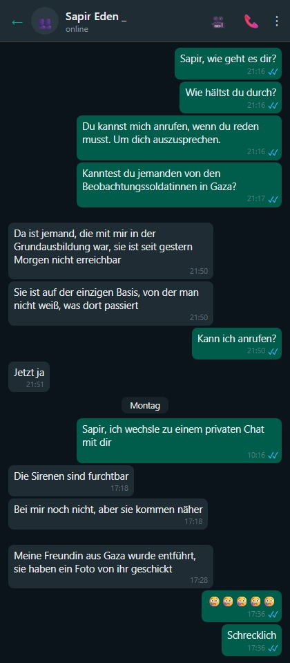
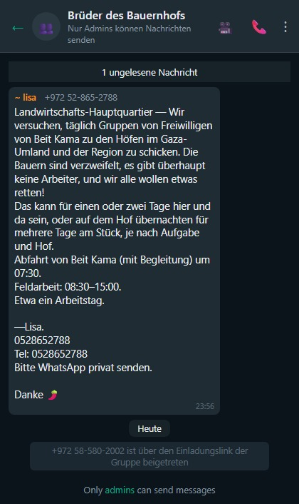
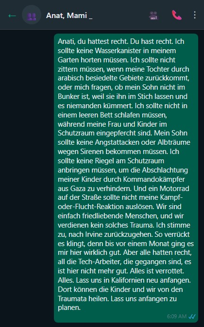
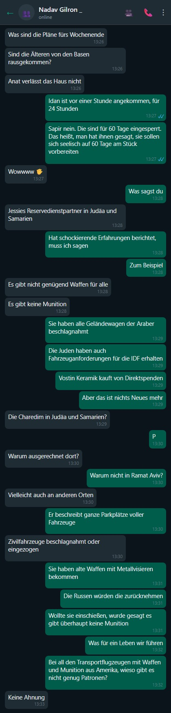
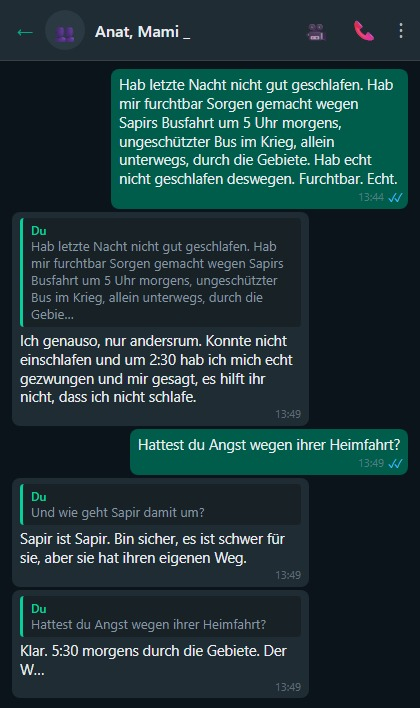

# Eiserne Schwerter, ein Tagebuch von der Heimatfront.

## Der verfluchte Schabbat, Tag 1 des Krieges (7. Oktober 2023):

#### Die große Party beginnt ohne uns.

Sukkot. Wir sind am Ende einer einwöchigen Jeep-Tour durch Rumänien. Die haben die Party angefangen und sich nicht mal die Mühe gemacht, auf uns zu warten.

Am siebten und letzten Tag der Reise. Raketen, Entführte, Tote und noch mehr Hiobsbotschaften.

Anat wacht morgens auf, in Rumänien, und sieht Warnmeldungen des Heimatfrontkommandos. Und wir sind im Ausland. Surreal!

Ich beschließe, die Flagge von unserem Jeep abzunehmen (in Rumänien). Damit man uns im Ausland nicht als Israelis erkennt.

Idan ruft an und sagt, wir kapieren überhaupt nicht, was im Land passiert.

Idan sagt, so etwas hat die Welt noch nicht gesehen.

Idan erzählt, die Grenze zu Gaza hat sich „aktualisiert".

Zu unserem Nachteil. (Jedes Mal, wenn ich diesen Satz lese, den ich selbst geschrieben habe, steigt mir etwas in der Kehle hoch.)

Dass drei IDF-Stützpunkte sich in Luft aufgelöst haben. Dass die Stützpunkte jetzt verbrannt sind und unter Hamas-Kontrolle stehen.

Dass Kibbuzim abgebrannt und leergeräumt wurden. Und die Bewohner schon nach Gaza „umgesiedelt" wurden. (Geiseln.)

Meiner Meinung nach hat sich Idan vertan und die 19. Staffel von Fauda geschaut.

Unser Gefühl: Benommenheit. Wir sind im Ausland. Weit weg. Spüren, dass uns eine Dimension fehlt. Wir sind so weeeiiit weg von allem.

Idan sagt, es sei Jom Kippur all over again.

Und ich bin mir sicher, Idan übertreibt.

Schabbat heute. Idan wurde einberufen. Das ist ungewöhnlich. Nimmt das Auto, parkt es neben seiner Einheit. Schreibt „Zahal" drauf, damit er keinen Strafzettel kriegt. Anat will, dass wir noch ein paar Tage in Rumänien bleiben.

Aber ich fühle eine zu starke Verbundenheit mit dem Land. Jüdisch sein heißt auch: nicht abhauen, wenn es hart wird.

Die Fluggesellschaft storniert unseren Flug nach Hause. Und dann stuft sie ihn wieder als regulären Flug ein.

Nach seelischen Strapazen [[aber dazu in einem anderen Beitrag]](https://edenguy.wixsite.com/blog/post/%D7%98%D7%99%D7%A1%D7%94-155) kommen wir im Land an.

Heute hatten wir keine Sirenen.

Anat und die Kinder schlafen im Schutzraum.


## Tag 2 des Krieges (der schwerste Tag)

Ich fühle mich wie dieses Kind in der ersten Klasse, das am ersten Schultag nicht da war, und das ganze Jahr das Gefühl hat, etwas verpasst zu haben, und fragt: „Na, was war am ersten Tag?"

Wir hören, dass Beobachterinnen der Gaza-Division in einem Raum eingesperrt, bei lebendigem Leib verbrannt und dann zur Sicherheit hingerichtet wurden. Von wem sie das wohl gelernt haben.

Sapir, meine Beobachterin, erzählt, dass es einen Cyberangriff auf die Kameras gab.

Die Beobachterinnen waren blind.

Und als die Kameras wieder liefen, sahen die Beobachterinnen Horden von Terroristen über den Grenzzaun strömen.

Zur gleichen Zeit gab es auch einen Cyberangriff auf die Kommunikation.

Die Beobachterinnen konnten keine Verstärkung rufen. Der Funk war angegriffen.

Der Rest ist Geschichte.

Sapir hat vor einem halben Jahr den Beobachterinnenkurs abgeschlossen.

Sapir wurde einem Posten zugeteilt. Genauso gut hätte sie in Gaza stationiert sein können.

Die Wahrscheinlichkeit dafür macht mir Angst.

In einem Paralleluniversum habe ich jetzt eine Tochter, die in Gaza als Geisel gehalten wird.

Oder Schlimmeres.

Wir halten bei der Arbeit eine Versammlung des gesamten israelischen Standorts ab.

Menschen lassen ihrem Herzen Luft.

- Ich warte auf den Einberufungsbescheid. Und bekomme Aufgaben von meinen Vorgesetzten. Und was, wenn ich im Kampf falle? Niemand bei der Arbeit wird wissen, dass ich gefallen bin. Die Leute im Büro werden mich ein paar Wochen lang nicht sehen und einfach vergessen, dass ich existiert habe.

- Wird das Unternehmen weiterhin unsere Gehälter zahlen? Auch nach ein oder zwei Monaten Kampf, wenn wir nicht produktiv sind? Wie bezahlen wir den Kindergarten und die Hypothek?

- Ich habe Meetings mit Kunden. Heute bin ich zum Meeting erschienen, aber man sagte mir, das Meeting sei abgesagt, weil mein Kunde in Gaza gefangen gehalten wird.

Kein Auge bleibt bei diesem Gespräch trocken.

Es ist schrecklich und erschütternd.

Ich habe noch nie Gefühle in dieser Intensität erlebt.

Vielleicht am 11. September.

Nach diesem Gespräch rufe ich Idan an. Erzähle ihm, was im Meeting hochkam. Kann die Tränen nicht zurückhalten. Heule ihm am Telefon vor.

Das ist der Tag, der mir seelisch am schwersten fällt.

Ein Kind sollte seinen Vater nicht zerbrechen sehen.

Oder vielleicht doch?

In den Nachrichten: zu Hause bleiben. Terroristen in Pickups sind auf den Straßen unterwegs.

Einen Pickup mit Terroristen hat man anderthalb Kilometer von unserem Haus entfernt gefunden.

Ich verklebe die Fenster zur Straße hin mit Karton. Damit kein Licht von der Straße zu sehen ist.

Das sind Dinge, die mein Großvater im Unabhängigkeitskrieg gemacht hat. Als sie aus der Luft bombardiert wurden. Verdunkelung.

Pikud HaOref gibt eine Sondermeldung raus, die — da bin ich mir sicher — keinem einzigen Haushalt in Israel ein Gefühl von Sicherheit gibt.

„Sondermeldung" an die Bürger: Das Heimatfrontkommando ruft heute Abend dazu auf, Trockennahrung, Wasser und weitere Vorräte für 72 Stunden zu bevorraten. Der Aufruf richtet sich an alle Bürger.

Dies sind die Anweisungen:

◾ Wasservorrat von 3 Litern pro Person und Tag, für 72 Stunden

◾ Vorrat an Trocken- und Konservennahrung

◾ Beleuchtungsmittel oder batteriebetriebene Taschenlampe

◾ Mittel zum Empfang von Warnungen und Updates — batteriebetriebenes Radio und Powerbanks für Mobiltelefone

◾ Medikamente

◾ Erste-Hilfe-Set

◾ Persönliche Dokumente, Ausweise und Bargeld

Portugal will Israelis ein Flüchtlingsvisum ermöglichen. Ich überlege ernsthaft.

Die Familie ist in Alarmbereitschaft.

Ich bereite 400 Liter Wasser vor.

Fahre los, um den Familientank vollzutanken.

Alarmbereitschaft, kein Scherz.

Lior schreibt einen Brief an die Soldaten.

Ich rufe Sapir an. Sapir sagt, Terroristen sind in Ortschaften im Nachbarabschnitt eingedrungen. Mir wird schwarz vor Augen. Mir ist schlecht.

Ich bin in Panik. Werden sie den Angriff auf die Beobachterinnen in Gaza wiederholen?

Der Stresspegel steigt und steigt. Brodelt. Droht überzukochen. Die Angst ist kaum auszuhalten.

Ich rufe Idan an. Idan sagt: wenn in den Medien zum Hamstern von Batterien und Kerzen aufgerufen wird, heißt das, die Hisbollah aus dem Norden und der Iran sind auch zur Party eingeladen.

Der Stresspegel erreicht den Siedepunkt.

Ich weiß nicht, was ich mit mir anfangen soll.

Es ist erst der zweite Tag. Und die Zukunft sieht überhaupt nicht rosig aus.

Morgen wird es besser. Ich belüge mich selbst.

Anat und die Kinder schlafen im Schutzraum.

Heute gab es 3 Sirenen.


## Tag 3 des Krieges

Alle paar Stunden mache ich einen Check-in mit Idan. Und mit Sapir.

Sapir erzählt, dass alle Wehrdienstleistenden in den Süden geschickt wurden.

Zwei Reservisten bewachen sie.

Na dann. Jetzt bin ich beruhigt...

Sapir erreicht ihre Freundin vom Beobachterinnenkurs nicht, die bei der Gaza-Division war.

Anat und ich wissen bereits, was mit ihr passiert ist. Aber wir wollen es nicht erzählen.

Sapir gibt uns einen Namen und fleht uns an herauszufinden, was mit ihr geschehen ist.

Sapir weiß absolut nichts über das Schicksal der Beobachterinnen.

Es zerreißt uns. Und wir sagen ihr nicht, dass ihre Freundin von der Hamas entführt wurde.

Endlose Schlangen von Leuten, die Blut spenden wollen. Rührend. Auch Eden steht in der Schlange zum Spenden.

Fahre zur Tankstelle, um mich mit noch mehr Wasser einzudecken. Und mehr Trockennahrung.

Bereite einen Holzbalken für die Schutzraumtür vor, damit man sie nicht von außen öffnen kann.

Die Kinder kapieren nicht, wozu das gut sein soll.

Sollen sie ruhig weiter nicht kapieren.

Aber der Balken überzeugt mich nicht. Nicht stabil genug.

Heute hat mich die Sirene mitten im Training erwischt. Mein Workout unterbrochen. Das geht jetzt echt zu weit.

Meine Cousine Stacey aus Philadelphia meldet sich. Will Updates. Was passiert in Israel? Wie weit sind wir von Ground Zero?

Ich eröffne eine WhatsApp-Familiengruppe mit ihr und poste Updates.

Sie ist einfach fassungslos. Lädt uns alle zu sich ein. Es ist Platz.

Anat und die Kinder schlafen im Schutzraum.

Heute gab es zwei Sirenen.





Tag 4 des Krieges

Idan kam kurz nach Hause, Auto zurückbringen, Unterwäsche wechseln, und rannte zurück zur Einheit. Zehn Minuten war er da.

Er sagt, er versteht nicht, wie wir einfach zu Hause sitzen und warten, dass es vorbeigeht. Wie wir nicht mitmachen. Zur Kriegsanstrengung beitragen, irgendwas tun, kämpfen.

Einfach zu Hause hocken und auf bessere Zeiten warten. Er sitzt 19 Stunden am Tag vor der Tastatur. Vielleicht 20. Seit einer Woche. Kämpft. Er ist rund um die Uhr von Menschen umgeben, die was tun.

Plötzlich kommt er nach Hause und sieht Leute, die Löcher in die Luft starren.

Klar, er versteht, dass wir Zivilisten sind und das keiner von uns erwartet, aber er läuft seit einer Woche auf 180% CPU, und plötzlich sieht er seine beiden hirntoten Eltern zu Hause sitzen — und das ist verstörend. Der Kontrast.

Ich erzähle Idan, dass ich 100 warme Mahlzeiten kochen und zu Sapir auf den Stützpunkt bringen wollte. Aber sie meinte, es gibt genug Essen in der Kantine.

Ich denke über Idans Worte nach und beschließe, mich freiwillig zu melden — Landwirten helfen, die eingezogen wurden.

Es fehlen Arbeitskräfte in der Landwirtschaft. Ernte bleibt auf dem Feld liegen. Herzzerreißend. Gutes Essen. Das vergammelt.

Am liebsten würde ich dort helfen, wo es am nötigsten ist. In den Gemeinden am Gaza-Grenzgebiet. Aber Anat legt ein Veto ein.

Ich kontaktiere Leket Israel. Und mache mit ihnen einen Termin für morgen aus.

Sapir bekommt ein Foto ihrer Freundin in Fesseln in Hamas-Gefangenschaft. Es bricht uns das Herz, dass sie es auf diese Weise über ihre Freundin erfährt.

Galit, eine Freundin aus der Grundschule, ruft an. Erzählt, dass Assaf, ein Klassenkamerad, erfahren hat: Seine Tochter, Soldatin, wurde im Schlaf auf dem Stützpunkt der Gaza-Division erschossen.

Assaf Groman ist völlig am Boden zerstört.


Noa Marciano, Sapirs entführte Freundin, wird in den Hamas-Tunneln festgehalten.


Galit versteckt sich hinter dem Grenzzaun an der Straße während einer Sirene.


Tag 5 des Krieges

Gehe früh morgens einkaufen.

Die Regale im Supermarkt sind ziemlich leer.

Keine Lieferungen, keine Mitarbeiter im Supermarkt, keine Ware, nur Kassiererinnen.

Die Regale sind leer. Wie in Osteuropa zu Zeiten des Kommunismus.

Am Nachmittag hat ein Nachbar die Polizei gerufen — eine verdächtige Person außerhalb der Siedlung in den Sanddünen, mit einem großen Rucksack.

Als ich zum Rucking losging (30-Kilo-Rucksack, Wandern in den Sandhügeln neben dem Haus), hielt mich ein Streifenwagen an. Wollte meinen Ausweis sehen. Haben mich natürlich sofort gehen lassen. Aber man sieht, wie nervös und verängstigt die Leute sind.

Als ich Sapir von dem Vorfall erzähle, rollt sie sich vor Lachen.

Immerhin konnte ich sie zum Lachen bringen.

Anat druckt Mandalas aus und malt mit den Kindern.

Ich sage meinem Chef, dass ich es schwer habe, nicht mehr so produktiv bin wie vorher. Er hat volles Verständnis.

Sapir erzählt, die Mädchen in der Kommandozentrale haben beschlossen, Schabbat zu halten — zum Gedenken an die Beobachterinnen, die ermordet oder entführt wurden.

Wir sollen nicht versuchen, sie am Schabbat zu erreichen. Handy ist aus. Sie halten Schabbat.

Das hat mir noch gefehlt. Dass Sapir jetzt fromm wird.

Ich sehe mich schon bei Osher Ad Einweggeschirr kaufen, weil Sapir sich weigert, mit uns am Schabbattisch zu sitzen.

Das hat mir wirklich noch gefehlt!!!

Sapir beruhigt mich und sagt, es sei einmalig.

Beruhigt mich nicht. Jeder Baal Tschuwa fängt mit einem einzigen Mal an.

Ich hatte eine Idee für eine App.

```
Statt alle zu fragen, ob alles in Ordnung ist, nach einem Raketenalarm.
Ich registriere mich,
markiere, von wem ich wissen will, dass er in Ordnung ist.
Nach einer Sirene markiere ich, dass ich in Ordnung bin.
Und dann kann ich sehen, wer von Freunden/Familie in Ordnung ist und wer nicht geantwortet hat.
Es wird eine schöne Matrix sein, die sich langsam asynchron grün füllt.
Und nach 5 Minuten bekommen wir eine Benachrichtigung, wer nicht geantwortet hat.
Einfachstes Pub-Sub.
(Die App zeigt auch an, wer einen niedrigen Akkustand hat oder außerhalb der Reichweite ist und deshalb nicht geantwortet hat. Und jeder Nutzer muss seine Follower genehmigen. Privatsphäre.)
Hatte die Idee schon vor 15 Jahren, während der Anschläge.
Aber jetzt ist sie relevanter.
Ein Tag Arbeit, um das aufzusetzen.
Wird ein Hit.
React, AWS.
```

Die Freunde sind begeistert von der Idee. Anat weniger.

Heute gab es zwei Sirenen.

Anat und die Kinder schlafen im Schutzraum.


Tag 6 des Krieges

Wache um 3 Uhr morgens auf. Kann nicht einschlafen. Der Schlaf flieht.

Schreibe mit meinem Freund Barel.

Er fragt, ob ich unsere Gespräche in mein Kriegstagebuch aufnehme.

Bitteschön. Hiermit aufgenommen.

Barel patrouilliert in seiner Siedlung mit einer Waffe. Deshalb ist er um 3 Uhr morgens verfügbar.

Ich frag ihn, wie die Mizrachim so warm, liebevoll und herzlich sein können, aber die Araber so bösartig und grausam.

Er braucht lange zum Antworten, und ich befürchte, er könnte beleidigt sein, dass ich Mizrachim mit Arabern vergleiche.

Aber ich meinte es eigentlich als Kompliment.

Barel erzählt von einer Lag-BaOmer-Szene aus seiner Kindheit, die sich ihm eingebrannt hat: ein arabischer Junge, der Tauben quälte, sie anzündete, ihnen Böller reinsteckte.

Grausam sind sie, die Araber.

Barel schickt ein aktuelles Foto von sich. Von seiner nächtlichen Patrouille.

Und ich rate ihm dringend, sich zu rasieren, bevor ihn noch die Grenzpolizei anhält.

Trete dem Forum „Brüder in der Landwirtschaft" bei. Suche Möglichkeiten, freiwillig zu helfen. Man fragt mich, ob ich melken kann.


Trete dem Forum „Brüder in der Landwirtschaft" bei.




Tag 7

07:00 Uhr, Adi (meine Schwester) ruft an.

An der Uhrzeit merke ich: irgendwas ist passiert.

Adi erzählt mit zitternder Stimme: Ihre Tochter Mai, die seit anderthalb Jahren in Australien lebt, hat beschlossen, zurückzukommen. Um zu kämpfen. Ihr Zuhause während zweieinhalb Jahren Wehrdienst wurde zerstört. (Gaza-Brigade.) Sie kann nicht tatenlos rumsitzen.

Adi ist voller Angst. Versucht sie zu überreden, nicht zu kommen.

Aber Mai hat sich entschieden.

Papa ruft an. Wir reden.

Papa — „Wie haben wir nichts aus dem Jom-Kippur-Krieg gelernt?"

Ich — Ich versprech dir: der Jom-Kippur-Krieg wird auch ein drittes Mal passieren, auch den Enkeln, in 50 Jahren. Unmöglich, eine Grenze 200 Jahre hermetisch abzusichern. Dinge passieren. Werden passieren.

Papa — Man muss den Bildungsminister auswechseln. Israels Kinder kennen keine Geschichte. Wieso kennen meine Enkel keine Geschichte? Und warum wissen meine Kinder nichts über die Zeit vor 2000?

Ich — Werde genervt, hab keinen Bock auf Vorwürfe von jemandem, der den Bildungsminister ersetzen will, und lege auf.

Es heißt, Hunde haben sich an die Sirene gewöhnt und rennen als Erste in den Schutzraum.

Nur Shuki, unser Hund, ist halb taub und rennt bei keiner Sirene irgendwohin.

Heute gab es zwei Sirenen.

Anat und Lior schlafen im Schutzraum.


Tag 9 des Krieges

OK, heute regnet es richtig. Rufe bei Leket Israel an und mache einen Termin für morgen. Morgen ganz sicher.

Kaufe einen Riegel für die Schutzraumtür. Montiere ihn. Anstelle des fragwürdigen Holzbalkens. Zeige Lior, wie man nietet. Erkläre ihm den Unterschied zwischen Mauerbohrer und Metallbohrer.

Die Kinder lernen heute von zu Hause. Per Zoom.

Anat spielt jeden Tag jede Menge Brett- und Kartenspiele mit den Kindern.

Sie genießt es auch sehr. Entschädigung für all die Jahre, in denen sie sich geweigert hat, Spiele zu spielen.

Die Kinder werden süchtig nach Spielen mit Anat.

Mai hat sich einberufen lassen.

Heute zwei Sirenen.

Anat schläft mit Lior im Schutzraum.


Tag 10 des Krieges

Heute ist der Tag, an dem ich für einen Tag Bauer bin.

Ich gehe in der Landwirtschaft helfen.

Ein riesiges Feld in Rischon LeZion. Wir ernten Kohlrabi.

Wahnsinnig viele Freiwillige. Aus dem ganzen Land. Jeden Alters. Es wärmt einem das Herz, diesen Zusammenhalt zu sehen.

Kohlrabi pflücken, Wurzeln und Blätter ab, Eimer füllen, und wenn der voll ist, den großen Container damit befüllen.

Nach drei Stunden sind alle müde. Aber zufrieden.

Zu Hause versuche ich, Lior abzulenken. Wir füllen eine große Schüssel mit Wasser und Unmengen von Eis.

Wir tauchen den Kopf in die Schüssel. Das hat viele positive Wirkungen. Aktiviert das parasympathische Nervensystem, setzt Endorphine frei, stärkt das Immunsystem.

Es stellt sich heraus, dass an den Seiten des Kopfes Kälterezeptoren sitzen. Deshalb ist das Eintauchen des Kopfes in Eiswasser fast wie ein Eisbad für den ganzen Körper.

Wir kriegen beide einen Brain Freeze.

Wir machen auch die Dead-Hang-Challenge an der Stange. 100 Sekunden hängen.

Ich schaffe 100 Sekunden. Gerade so. Lior schafft eine Minute. Was ziemlich beeindruckend ist.

Anat bereitet mit den Kindern Burekas mit Käse und Kartoffeln zu.

Ich möchte mit Lior Schokoladenkugeln machen, aber wir haben keine Petit-Beurre-Kekse.

Noch eine herzzerreißende Nachricht von Sapir.


Tag 11 des Krieges

Lior schickt mich zu seiner Schule, um Bücher und Hefte zu holen, die er dort vor dem Krieg gelassen hat.

Die Schule ist verlassen und leer. Wie in den Corona-Tagen.

Ich kaufe Petit-Beurre. Heute machen wir zusammen Schokoladenkugeln.

Mein Kumpel Guri findet raus, dass die Terroristen, die vor 11 Tagen nach Israel eingedrungen sind, unter Drogen standen.


Tag 12 des Krieges

Die Hamas gab heute bekannt, dass ihr hochrangiger Kommandeur Ayman Nofal von der IDF im Zentrum des Gazastreifens getötet wurde — die bisher größte gezielte Tötung. Er koordinierte die verschiedenen Bataillone der Terrororganisationen im Streifen.

Heute hatten wir 7 Sirenen. Die Tötung von Ayman erklärt das.

Nachts kriegt Lior eine Panikattacke. Zittern, flaches Atmen.

Anat macht Atemübungen mit ihm.


Ich stoße auf ein Überwachungskamera-Video vom Kibbuz Be'eri. Man sieht, wie Scharen dort eindrangen.

Es sah aus wie ein Marktplatz in Gaza. Kämpfer, Kinder, Alte und Behinderte, Jugendliche. Alles querbeet.

Es war wie ein Schulausflug. Jeder marschierte rein, überquerte die Grenze nach Israel, nahm sich ein Souvenir mit — einen Juden zum Anbinden im Wohnzimmer — und ging zurück nach Gaza, nachdem er die Bewohner misshandelt hatte.

Tag 13 des Krieges. Shuki lernt, mit uns in den Schutzraum zu rennen.

Wir sind nicht sicher, ob er auf die Sirene reagiert oder darauf, dass er uns alle panisch zum Schutzraum rennen sieht.

Wir beschließen, es zu testen.

Wir zählen rückwärts: 3...2...1... und rennen zusammen zum Schutzraum.

Shuki rast mit uns.

Das war's. Der Hund ist taub.

... Wie sich rausstellt, halten sich noch ein paar Dutzend Hamas-Terroristen in Israel auf.

Israelische Araber geben ihnen Essen. Und Unterschlupf.

Wenn es etwas gibt, das einem wirklich Angst macht... dann das.


[Das ist der Stoff, aus dem meine Albträume sind](https://edenguy.wixsite.com/blog/post/%D7%A7%D7%9C%D7%90%D7%A5-%D7%91%D7%9E%D7%98%D7%A2-%D7%94%D7%90%D7%A0%D7%95%D7%A0%D7%95%D7%AA). Dutzende Terroristen bewegen sich frei in Israel.

Alle paar Monate verfolgt mich diese Szene im Traum. Am Ende renne ich immer vor bewaffneten Terroristen weg.

Aber jetzt ist es real.

Und es gibt Berichte von Leuten, die stundenlang die Klinke festgehalten haben — gegen Terroristen auf der anderen Seite der Tür.

Angesichts dessen, und des Stresses, der sich nach einer ruhigeren Woche wieder aufbaut, beschließe ich: die Riegel am Schutzraum müssen besser werden.

Ich habe einen Riegel, und möchte drei weitere installieren.

Das wird mir etwas Seelenruhe verschaffen.

Baumarkt nebenan: alle Riegel ausverkauft. Ace: nicht massiv genug.

Home Depot... auch nicht.

Am Ende rufe ich Bar-El an, den Freund Barel, der mir solide Riegel bringt. Zusammen installieren wir sie.


Tag 14 des Krieges

Ich erwäge, einen Waffenschein zu beantragen.

Verrückte Zeiten. Nie im Leben hätte ich gedacht, mal eine Waffe haben zu wollen.

Leider erfülle ich die Bedingungen nicht. Schützenprofil 02. Nötig ist 03. Oder Wohnort in einer Frontgemeinde.

Ich tröste mich damit, dass Rischon LeZion in anderthalb Wochen Frontgemeinde sein wird. Dann renne ich als Erster zum Waffenschein.

Sapir hat eine Ukulele. Sie hebt die Moral der Kämpfer in ihrer Einheit mit ihrer Ukulele.


Sapir erzählt, dass man ihnen gesagt hat, sie sollen sich mental auf 60 Tage auf dem Stützpunkt vorbereiten.

Wie man sich mental darauf vorbereiten soll, ist mir schleierhaft.

Es geht das Gerücht um, israelische Araber laufen durch Städte, auch in Tel Aviv, und fotografieren Häuser.

Dutzende Posts darüber auf Facebook.


Der Schekel verliert an Wert.

Tag 15 des Krieges

Heute ist ein Festtag zu Hause.

Idan kommt für 24 Stunden Erholung.

Ich hole ihn am Bahnhof ab.

Große Freude. Der verlorene Sohn kehrt heim.


Idan erzählt von seinen Erlebnissen in der Einheit.

Erfahrungen, die er — da bin ich mir sicher — nirgendwo anders und zu keiner anderen Zeit machen wird.

Wir veranstalten ein Freitagabendessen zu Ehren von Idan.

Sapir fehlt uns.

3 Raketen aus dem Jemen auf Israel. Die Front wird heißer, keine Frage.

Der Abschuss von drei Raketen und 15 Drohnen durch die Huthi auf Israel und deren Abfang durch das amerikanische Kriegsschiff sind die Verwirklichung der Drohungen und Versprechen der letzten Woche. Der Beschuss erhöht jedoch die Wahrscheinlichkeit, dass auch die Hisbollah in den Krieg eintritt | Analyse

Am Tag 13 des Krieges traten Iran und die USA in den Krieg ein. In Teheran setzte man die Drohungen fast wörtlich um, den Krieg auf weitere Schauplätze auszuweiten, und die Amerikaner erfüllten ihr Versprechen, Israel auch operativ zu unterstützen, wenn nötig — nicht mit Bodentruppen, sondern durch das Abfangen von Raketen und Drohnen, die von iranischen Stellvertretern aus Gebieten abgeschossen werden, die nicht in der Nähe der israelischen Grenze liegen.

Amerikanische Soldaten werden nicht am Boden in Israel und für Israel kämpfen, aber die USA werden bei der Abwehr von Raketensalven aus den entfernten Flanken der radikalen schiitischen Achse helfen.

Tag 16 des Krieges

Heute Morgen hatten wir um 09:00 Uhr eine Sirene. Das ist ungewöhnlich.

Sieht so aus, als hätte die IDF den Norden des Streifens unter Kontrolle. Die können nur noch aus dem Süden schießen.

Wir sind das neue Tel Aviv. Tel Aviv scheinen sie nicht mehr zu erreichen. Wir sind das nördlichste Ziel.

Unsere Haushaltshilfe meint, wir übertreiben, es sei doch genug Zeit, um in den Schutzraum zu kommen.

Lior bittet darum, bei meiner Trainingsroutine im Garten mitzumachen.

Wir legen seine Lieblings-Playlist auf und trainieren zusammen. Heute Arm-Training.


Steak und Lobster. Auf dem Deck des Flugzeugträgers Gerald Ford im Mittelmeer gab es gestern Abend Steak und Lobster. Die Matrosen wissen: so ein Essen gibt es an Feiertagen — oder kurz vor einem Einsatz.


Lior wachte heute Nacht aus einem Albtraum auf.

In seinem Traum isst er einen Keks. Einen Granola-Keks, den er mit Mama und Itai gebacken hat. Dann eine Sirene. Aber eine spezielle — nur eine halbe Minute bis zum Schutzraum statt anderthalb. Lior rast zum Schutzraum, den Keks im Mund. Vor lauter Stress verschluckt er sich an dem trockenen Keks. Papa (ich) macht den Heimlich-Griff, rettet ihn, der Keks fliegt ihm aus dem Hals. Mama sieht den Keks unversehrt aus Liors Hals fliegen und kippt um. Und dann bin ich aufgewacht.

Tag 17 des Krieges

Wache um 02:00 Uhr auf und kann nicht wieder einschlafen.

Alle meine roten Linien sind überschritten.

Ich will hier nicht mehr leben.

Wir haben es versucht. Wirklich versucht.




Mache für Sapir einen Termin zur Erneuerung ihres amerikanischen Passes im US-Konsulat in der Hayarkon-Straße.


Heute ist ein glücklicher Tag.

Sapirchen kommt nach Hause zur Erholung.

Die kleinen Freuden des Lebens.

Sapir kommt um 14:00 Uhr. Und muss morgen schon vor 07:00 Uhr zurück zum Stützpunkt.

Ich nehme sie zum Einkaufen mit. Ausrüstung ergänzen. Thermounterwäsche, Jacke, Socken. Ricochet gibt uns einen Gutschein.

Einen fetten Gutschein.

Sapir erzählt Anekdoten.

Scheint sich nicht verändert zu haben.

Ziemlich normales Verhalten.

Keine posttraumatische Belastungsstörung.

Obwohl sie von der Kompaniechefin aus der Grundausbildung erzählt, die ermordet wurde. Von Beobachterinnen-Kameradinnen, die ermordet oder entführt wurden.

Aber es scheint an ihr abzuperlen. Keine Spuren.

Ich glaub, das kommt alles in ein paar Jahren hoch.


Tag — ich höre auf zu zählen...

Der Durchschnitts-IQ in der Bevölkerung liegt bei 100 mit einer Standardabweichung von 15.

In Gaza liegt der Durchschnitt bei 85, mit der gleichen Standardabweichung.

Heißt: Unter 2 Millionen Gazanern gibt es 120 Leute mit einem IQ von 145. Genies.

Mir macht die Bodenoffensive richtig Angst. Da warten garantiert Überraschungen auf uns. Unser desolater Geheimdienst kann die nicht vorhersehen.

Die 120 Genies aus Gaza haben uns sicher Fallen gestellt.

Tag folgt auf Tag.

Die Verzweiflung wächst von Tag zu Tag.

Und ich habe keine Lust mehr, das Tagebuch zu aktualisieren.

Anat und Lior schlafen immer noch im Schutzraum.

31. Oktober, Tag 20 des Krieges

Wache am Morgen des 31. Oktober auf. Reib mir die Augen, geh runter ins Wohnzimmer.

Sehe eine Girlande aus Luftballons im Wohnzimmer hängen.

Und verstehe nicht ganz, was das soll.

Ach, Mensch. Heute ist mein Geburtstag.

Vergessen.

Überrascht.

Schön, mal Aufmerksamkeit zu kriegen.


Zu Ehren meines Geburtstags beschließe ich, einen Geländelauf im offenen Feld zu machen.

Anat warnt: Im offenen Feld werden keine Raketen abgefangen.

Ich ignoriere das.

Meine geistige Gesundheit ist mir wichtiger.


Mittags, nach einem Arbeitsmeeting, ruft Lior mich in die Küche. Ich komme, und sie singen mir „Happy Birthday"; es gibt auch eine Torte.

Weil seit einem Monat nur ich einkaufen gehe, hab ich ahnungslos gekauft, was auf der Liste stand: Kekse und Käse für einen Käsekuchen.

Sie haben mich reingelegt.

Am Nachmittag fahre ich zu Decathlon, kaufe einen roten Boxsack, hänge ihn im Garten auf und schreibe „Hamas" mit schwarzem Filzstift drauf.

Jetzt lassen die Kinder jede Menge Aggressionen an Hamas aus. Die Emotionen des letzten Monats, all die Sirenen, die Frustration. Alles kommt in entfesselten Fäusten raus.

Das ist eine tolle Sache. Große Befriedigung, Hamas zu treten. Therapeutisch.


Tag 30 des Krieges

Sapir kommt für anderthalb Tage nach Hause. Zum ersten Mal so lange weg von der Kommandozentrale.

Wir fühlen uns wieder vollständig.

Sapir sieht gut aus. Wirkt richtig stark. Die unerträglichen Ereignisse — haben sie kaum angekratzt.

Ich bin zufrieden.

Sehr.


Ich nehme sie und die Jüngeren zum Eisessen. Bei „Andiamo".


Anat liebt dieses Foto. Patriotisch. Uniform und Flagge.


Idan schickt mir eine Nachricht auf WhatsApp.

Was soll das jetzt plötzlich?

Wieso wieder ein Rückfall in Tag zwei des Krieges?

Ich gehe wieder in volle Alarmbereitschaft, wechsle das Wasser im Schutzraum aus. Fülle Vorräte auf.


Ich drehe wieder am Rad. Schlafe nachts nicht gut.

Woher kam Idan plötzlich mit diesem Mist?

Versuch, noch ein paar Details rauszukriegen. Aber Idan ist im Bunker.

Kein Wort.

Und wieder eine Nachricht, die mich an den Jom-Kippur-Krieg erinnert:

Vor dem Hintergrund des Krieges gegen Hamas hat Jordanien angekündigt, seinen Botschafter in Israel zu Konsultationen zurückzurufen.

Der Anführer der Huthi droht Israel. Abdul-Malik al-Huthi, Anführer der vom Iran unterstützten Rebellen im Jemen, sagte: „Das jemenitische Volk wird nicht zögern, den Dschihad gegen Israel auszurufen."

Heute wurden Raketen von den Huthi-Rebellen aus dem Jemen in Richtung Rotes Meer abgefeuert.

Das im Jemen entzündete Streichholz könnte Saudi-Arabien und die USA zwingen, Farbe zu bekennen.

Zweifellos wird die Front heißer.

Wer hat je von diesen Huthi gehört? Woher kam das? Jemen? Ist das überhaupt ein echtes Land?

Zum ersten Mal überhaupt in der Nähe des Nahen Ostens: das größte und teuerste Kriegsschiff der Welt. 90 Flugzeuge, 4.300 Besatzungsmitglieder und bewaffnete U-Boote: Die USA bringen Flugzeugträger vor Israels Küste in einer Demonstration der Unterstützung im Krieg gegen Hamas. Der Flugzeugträger „Ford", das größte und teuerste Kriegsschiff der Welt, wurde bereits im Mittelmeer stationiert, und nächste Woche soll auch die „Eisenhower" ankern.




Salesforce, die amerikanische Firma, gibt ihren israelischen Mitarbeitern einen Kriegsbonus. Die Mitarbeiter kriegen eine einmalige Prämie von 10.000 Schekel zum November-Gehalt.

Schön zu wissen, dass man uns sieht. Dass man an uns denkt.


Anat kommt nicht ans Schutzraumfenster, um es zuzumachen. Also bau ich eine Wäscheleine mit Umlenkrolle, damit sie es leichter schließen kann.

Anat ist nicht sonderlich beeindruckt.

Lior sagt, er will bei meinem Training mitmachen.

Eine gute Sache, die aus diesem verfluchten Krieg rauskommt.

Lior schließt sich mir an, und wir trainieren zusammen.

Lior hat einen guten Körper. Kräftig. Wenn er ein bisschen in sich investiert und trainiert, wird er zum Monster.


Diese Woche fahre ich endlich ins Büro nach Tel Aviv.

Ein bisschen Normalität.

Ein bisschen Fitnessstudio mit Menschen mit Puls.


Richtig schön, Leute zu treffen.

Flurgespräche.

Ich vermisse das sehr.

Auf dem Rückweg sehe ich zum ersten Mal Plakatwände mit Fotos der Entführten.

Aufwühlend.


Die Firma ermöglicht uns, mit einem Profi über die Schwierigkeiten, Krisen und Ängste zu reden.

Anat und ich verbinden uns per Zoom mit Kami, der Therapeutin.

Die hat echt was drauf. Im Gespräch beschließen wir: Schritt für Schritt raus aus dem Schutzraum. Raus aus dem Haus. Vielleicht gehen die Kinder zu den Pfadfindern. Zu Freunden, zur Schule. Kami hat uns echt geholfen.

Hätte nicht gedacht, dass ein einziges Zoom-Gespräch so viel bringt.

Anats Mutter kommt kurz vorbei und probiert unseren Schutzraum aus.


Anat verkündet: Heute Nacht schläft sie im Schlafzimmer. Und Lior in seinem Zimmer.

Aufregung. Nach 30 Tagen Schlafen im Schutzraum.

Zur Feier des Anlasses kriegen wir zwei nächtliche Sirenen. Eine um 21:00 Uhr. Und eine um 22:00 Uhr.

Lior verkündet: Hat hervorragend geschlafen.

Hat Anat schwören lassen: Wenn eine Sirene kommt, weckt sie ihn als Allererstes. Und vergisst ihn nicht.


Wir belegen Platz 3. Nach Sderot.

Respektabel.

Der tapfere Oded kommt ins raketengebeutelte Rischon LeZion, um mich zu besuchen.

Wir machen was Leckeres auf dem Grill und quatschen über den Krieg.


7. November. Ein Monat Krieg.

Lior zieht zum ersten Mal seit zwei Monaten sein Schulhemd an.


Schule.

Die Heimatfront kehrt langsam zur Normalität zurück.


Ich fahre ins Büro nach Tel Aviv.

Arbeitsroutine.

Plötzlich eine Durchsage: Schweigeminute um 11:00, zum Gedenken an die Opfer.

Wir stehen eine Schweigeminute lang still.

Was, erst ein Monat ist vergangen? Ich schwöre, es fühlt sich an wie ein halbes Jahr.

Wir kriegen Anstecker zum Gedenken an die Gefangenen und Gefallenen.


Alle in Solidarität.


Die fünfte Kriegswoche — die Noa-Woche

#### Mittwoch, 14. November. Anats Geburtstag.

Der schreckliche Tag, den wir gefürchtet hatten, ist gekommen.


Am Morgen schickt Sapir mir ein Snuff-Video von Hamas. Es soll zeigen, dass Noa Marciano durch IDF-Bombardierung getötet wurde.

Sapir hat Angst, es sich anzusehen. Bittet mich zu gucken und ihr zu erzählen, was drin ist.

Nach dem Ansehen sag ich Sapir: Ich glaub, das Ganze ist ein zynischer Hamas-Fake. Offensichtlich unglaubwürdig.

Etwa zwei Stunden später kommt Anat weinend angerannt. Sie hat erfahren: Noa Marciano wurde in Hamas-Gefangenschaft ermordet.

Das Schlimmste ist eingetreten.

Was für einen schönen Geburtstag wir Anat beschert haben.

Zitternd rufen wir Sapir an. Überbringen ihr die schreckliche Nachricht.

Sapir erzählt uns: Noa hat ihr in der Grundausbildung einen Brief geschrieben. Hat sie gebeten, ihn erst danach zu lesen.

Sapir hatte das bis heute vergessen.

Die ganze Familie sucht jetzt nach dem kleinen schwarzen Notizbuch — darin hat Noa Marciano einen wichtigen Brief an Sapir geschrieben.

Wir finden es nicht :(

Anat und ich laufen den ganzen Tag wie Zombies herum.

Ohne Lust auf irgendetwas.

Ich kann mir nur vorstellen, was unsere Sapirchen durchmacht.

Das ist ein sehr schwerer Tag für mich. Für uns. Einer der schwersten.


Keine Leiche. Die Familie sitzt Schiwa ohne Beerdigung.

Wir verabreden uns, am Donnerstag mit Sapir zur Trauerbekundung nach Modiin zu fahren.

Der Marsch der Geiselfamilien — auf dem Weg nach Jerusalem — wird vermutlich genau Donnerstagmittag bei ihnen vorbeikommen.


Hamas, eine Terrororganisation, hat der israelischen Supermacht den schwersten militärischen Schlag ihrer Geschichte versetzt. Die Täuschung war perfekt. Das Versagen des Geheimdienstes war absolut. Die Folgen waren katastrophal, und nur das Ausmaß der Demütigung übertraf das Versagen. Israel stand kurz vor einem historischen Friedensabkommen mit Saudi-Arabien, das den Friedenskreis mit der sunnitischen Achse geschlossen, die Palästinenser in eine schwarze Kiste eingeschlossen und ins Meer geworfen hätte. Stattdessen haben sie fast uns ins Meer geworfen. Der Übergang, den wir an jenem Schabbat, dem 7. Oktober, durchlebten, ist einer der schärfsten in der Geschichte. Mit einem Schlag verwandelte sich das israelische Imperium von einer selbstzufriedenen, arroganten und selbstsicheren Supermacht, die im Iran, in Syrien und überall dazwischen zuschlug, die ihre Geheimdienst-Gnaden an alle Verehrer verteilte, die den Takt im gesamten Nahen Osten vorgab und weltweit ein Leuchtturm der Technologie, Stärke und Nachrichtendienste war — zu einem schiffbrüchigen Boot in den Wellen, einer Nation in existenzieller Panik, Bürgern, die versuchen, sich eine Pistole oder ein Messer zusammenzukratzen, um damit unter dem Kopfkissen zu schlafen, selbst wenn sie mitten in Tel Aviv wohnen.

Die Zeit friert ein. Jeder Tag fühlt sich an wie der 7. Oktober.


#### Donnerstag

Heute sind wir mit Sapir nach Modiin gefahren. Zum Haus der Familie von Noa Marciano. Zur Trauerbekundung.

Ihre Mutter wirkt sehr beeindruckend.

Sehr.

Wir treffen dort eine Frau, die zum Kondolieren gekommen ist. Sie erzählt: Sie hat zwei Töchter. Eine Beobachterin, in Gaza entführt. Die andere nimmt am Marsch der Entführten teil.

Anat umarmt sie unter Tränen.

Es gibt nicht viel zu sagen.

Sie haben ein Trauerzelt aufgestellt. Darin versammeln sich Dutzende Männer mit Kippot und Rabbiner, sprechen Kaddisch, diskutieren die Wochenlesung.

Nervt mich, das Ganze. Die „Stärkung im Glauben" in Zeiten der Krise.

Wir gehen hoch in Noas Kinderzimmer. Sapir geht ihre Sachen durch, fotografiert die Korrespondenz zwischen Noa und ihrer Kommandantin.

Die Situation ist für niemanden leicht.

An der Seite: zwei große blaue Kisten mit israelischer Flagge — Noas persönliche Sachen, die die IDF den Eltern geschickt hat.

Herzzerreißend.


#### Freitag

Wir wachen am Freitagmorgen auf, und da kommt die Nachricht:

Tag 42 der Kämpfe | Die IDF hat den Leichnam der Soldatin Noa Marciano nach Israel überführt, die in Hamas-Gefangenschaft getötet wurde.

Also gibt es doch eine Beerdigung.

Der Leichnam wurde gestern in der Nähe des Shifa-Krankenhauses gefunden, einen Tag nach der Bergung des Leichnams von Yehudit Weiss aus dem Kibbuz Be'eri. Drei Palästinenser wurden bei einem IDF-Angriff in Dschenin getötet, die Truppe umstellte das Krankenhaus der Stadt. Blinken sprach mit Gantz und den Außenministern Ägyptens und Jordaniens und sagte, die USA würden sich gegen eine erzwungene Umsiedlung von Palästinensern aus Gaza aussprechen.


Sapir ist auf dem Weg von ihrer Einheit, um an der Beerdigung teilzunehmen.




Sapir fährt nach Modiin, um an der Beerdigung teilzunehmen und letzte Ehre zu erweisen.

Die Klasse von Lior hat Grüße an die Soldaten geschickt. Wärmt das Herz. Die Soldaten freuen sich.


#### Der 3. Kriegsmonat

Tag 78 des Krieges.

Heute wurde der Noa-Marciano-Weg eingeweiht. Sapir ist nach Modiin gefahren, zur Einweihungszeremonie.

In Modiin gibt es eine Tradition: Jeder gefallene Soldat aus der Stadt kriegt eine Straße nach seinem Namen.


Ein Freund von mir kommt diese Woche ins Ichilov-Krankenhaus. Notoperation.

Er erzählt: Alle anderthalb Stunden landen Hubschrauber aus dem Süden auf dem Landeplatz. Schwerverwundete.

Dutzende Verwundete pro Tag, oder mehr. Das Krankenhaus ist überflutet. Schließt die Notaufnahme. Extrem selten.

Das Mindeste, was ich tun kann: Blut spenden.


Freiwilligentag, Kaki-Ernte


