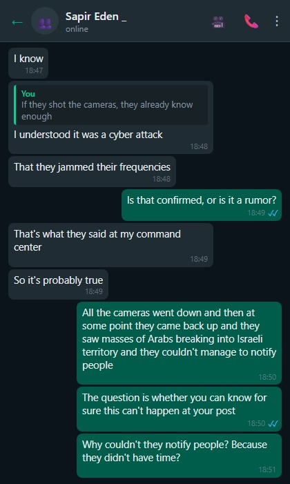
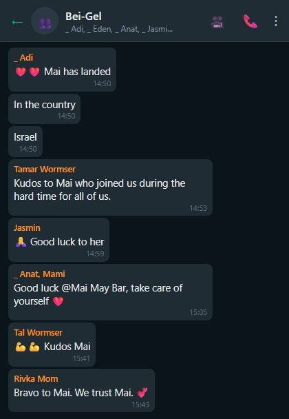

# Iron Swords, A Diary from the Home Front.

## The Cursed Saturday, Day 1 of the War (Oct 7, 2023):

#### The Big Party Starts Without Us.

Sukkot. We're at the tail end of a week-long jeep trip in Romania. They started the party and didn't even bother waiting for us.

On the seventh and final day of the trip. Rockets, hostages, dead, and more bad news piling up.

Anat wakes up in the morning, in Romania, and sees Home Front Command alerts. And we're abroad. Surreal!

I decide to take down the flag from our jeep (in Romania). So we won't be identified as Israelis abroad.

Idan calls and tells us we really don't understand what's happening back home.

Idan says the world has never seen anything like this.

Idan tells us the border with Gaza has been "updated."

For the worse. (Every time I read this sentence that I wrote, I get a lump in my throat.)

That three IDF bases have evaporated. That the bases are now burned, and under Hamas control.

That kibbutzim were burned and emptied. And the residents had already "relocated" to Gaza. (Hostages.)

I'm pretty sure Idan got confused and watched season 19 of Fauda.

Our feeling: total fog. We're abroad. Far away. We feel like we're missing a dimension. We are so faaaaaar from everything.

Idan says it's Yom Kippur all over again.

And I'm sure Idan is exaggerating.

It's Saturday. Idan was called up. That's unusual. He takes the car and parks it near his unit. Writes "IDF" on it so he won't get a ticket. Anat asks that we stay in Romania a few more days.

But I feel too connected to this country. Being Jewish also means you don't abandon ship when things get tough.

The airline cancels our flight home. And then reinstates it as a regular flight.

After emotional ordeals [[but that's for another post]](https://edenguy.wixsite.com/blog/post/%D7%98%D7%99%D7%A1%D7%94-155) we arrive back home.

There were no sirens for us today.

Anat and the kids sleep in the safe room.


## Day 2 of the War (The Hardest Day)

I feel like that kid in first grade who didn't come to school on the first day, and all year long he feels like he missed something, and asks: "So, what happened on the first day?"

We hear that lookout soldiers from the Gaza Division were locked in a room, set on fire, and then shot to confirm the kill. Just to be sure. I wonder who they learned that from.

Sapir, my lookout soldier, tells me there was a cyber attack on the cameras.

The lookout soldiers had no visual feed.

And when the cameras came back online, the lookout soldiers saw piles of terrorists crossing the separation fence.

At the same time, there was also a cyber attack on the communications.

The lookout soldiers couldn't call for backup because the comms were under attack.

The rest is history.

Sapir completed the lookout soldiers' course six months ago.

Sapir got her assignment. She could just as easily have been posted in Gaza.

The odds terrify me.

In a parallel universe, I have a daughter held hostage in Gaza right now.

Or worse.

We have an all-hands at work with the whole Israeli site.

People just let it all out.

- I'm waiting for my reserve call-up order. And I'm getting assignments from my managers. And what if I die in combat? No one at work will know I fell in battle. People in the office won't see me for a few weeks and will simply forget I existed.

- Will the company keep paying our salaries? Even after a month or two of fighting, when we're not productive? How will we pay for daycare and the mortgage?

- I have meetings with clients. Today I joined a meeting, but they told me the meeting was canceled because my client is being held captive in Gaza.

Not a dry eye in the room.

It's horrible and devastating.

I've never felt anything this intense.

Maybe on 9/11.

After this devastating call, I call Idan. Tell him about what came up in the meeting. Can't stop the tears. Crying to him on the phone.

This is the hardest day for me emotionally.

A child shouldn't see his father break down.

Or maybe he should?

They're telling us on the news to stay locked inside — terrorists in pickup trucks are roaming the roads.

They found a pickup with terrorists a kilometer and a half from our house.

I cover the windows facing the street with cardboard. So no light leaks out.

These are things my grandfather did in the War of Independence. When they were bombed from the air. Blackout.

Home Front Command puts out a freaky announcement. I'm sure it doesn't exactly fill anyone in Israel with confidence.

"Unusual announcement" to citizens: Home Front Command is calling on people tonight to stock up on dry food, water, and additional supplies for 72 hours. The call is addressed to all citizens.

These are the instructions:

◾ Water supply of 3 liters per person per day, for 72 hours

◾ Stock of dry and preserved food

◾ Battery-powered lighting or flashlight

◾ Means to receive alerts and updates — battery-powered radio and portable chargers for mobile phones

◾ Medications

◾ First aid kit

◾ Personal documents, IDs, and cash

Portugal will allow Israelis to apply for refugee visas. I'm considering applying.

The family is on high alert.

I prepare 400 liters of water.

Going to fill up the tank in the family car.

High alert for real.

Lior writes a letter to the soldiers.

I call Sapir. She tells me they've broken into settlements in the sector next to hers. Everything goes dark. I'm not okay.

I'm in a panic. Will they copy-paste the attack on the lookout soldiers in Gaza?

The stress level keeps rising and rising. Bubbling. About to burst. Hard to contain the terror.

I call Idan. Idan says if the media is telling people to stock up on batteries and candles, it means Hezbollah from the north and Iran too — they're all invited to the party.

The stress level reaches boiling point.

I don't know what to do with myself.

It's only the second day. And the future doesn't look rosy at all.

Tomorrow will be better. I'm lying to myself.

Anat and the kids sleep in the safe room.

Today there were 3 sirens.


## Day 3 of the War

Every few hours I check in with Idan. And with Sapir.

Sapir tells me they sent all the regular-service soldiers south.

Two reservists are guarding them.

That's it. Now I'm calm...

Sapir can't get in touch with her friend from the lookout soldiers' course, from the Gaza Division.

Anat and I already know what happened to her. But we don't want to tell.

Sapir gives us a name, and begs us to find out what happened to her.

Sapir doesn't know a thing about the fate of the lookout soldiers.

Our hearts ache. And we don't tell her that her friend was captured by Hamas.

Endless lines of people wanting to donate blood. Warms the heart. Eden is standing in line to donate too.

Driving to a gas station to stock up on more water. And more dry food.

I prepare a wooden plank for the safe room door, so it can't be opened from outside.

The kids don't understand what it's for.

I'd rather they keep not understanding.

But I'm not satisfied with this plank. It's not reliable.

Today the siren caught me mid-set. Interrupted my workout. This has gone too far.

My cousin Stacey, from Philadelphia, pops up and demands updates. What's happening in Israel? How far are we from ground zero?

I open a family WhatsApp group with her and drop updates.

She's simply horrified. Invites all of us to come to her. There's room.

Anat and the kids sleep in the safe room.

Today there were two sirens.


Day 4 of the War

Idan came home today to return the car, changed his underwear, and ran back to his unit. Spent ten minutes at home.

He says he doesn't understand how we're just sitting at home waiting for things to pass. How we're not contributing. Contributing to the war effort, doing something, fighting.

Just sitting at home waiting for better times. He's at his keyboard 19 hours a day. Maybe 20. For a week straight. Fighting. He's surrounded by people of action 24 hours a day.

Suddenly he comes home and sees people staring/gazing at walls.

Meaning, he understands we're civilians and nothing is expected of us, but he's been in 180% CPU mode for a week, and suddenly he sees his two brain-dead parents at home, and it grates. The contrast.

I tell Idan I wanted to cook 100 hot meals and bring them to Sapir, to her unit. But she said there's enough food in the mess hall.

Idan's words stick with me, and I decide to volunteer to help farmers who got their reserve call-up orders.

Farms are short-handed. Produce isn't being collected from the fields. Breaks your heart. Good food. Going to waste.

I'd like to help where it's really needed. In the communities near the Gaza border. But Anat vetoes it.

I contact Leket Israel. And schedule for tomorrow.

Sapir receives a photo of her friend shackled in Hamas captivity. Our hearts break — that this is how she finds out about her friend.

Gaalit, a friend from elementary school, calls today to say that Asaf, a classmate, received word that his daughter — a soldier — was shot in her sleep at the Gaza Division.

Asaf Groman is absolutely shattered.





Noa Marciano, Sapir's kidnapped friend, is being held in Hamas tunnels.


Gaalit takes shelter behind the highway barrier during a siren.


Day 5 of the War

Heading out early in the morning for shopping.

The supermarket shelves are pretty empty.

No deliveries, no workers at the supermarket, no merchandise — just cashiers.

The shelves are empty. Like Eastern Europe under communism.

In the afternoon, some neighbor calls the cops about a suspicious guy walking outside the neighborhood, in the sand dunes, with a big backpack.

That's me going out for rucking (a large 30-kilo backpack, walking through the sand hills near home). A police car stops me and asks for details. They let me go right away, of course. But it tells you something about how jumpy everyone is.

When I tell Sapir about the incident, she cracks up laughing.

Glad I managed to make her laugh.

Anat prints out mandalas and colors them with the kids.

I share my struggles with my boss, tell him I'm not as productive as before. He totally gets it.

Sapir tells us the girls at the command post decided to observe Shabbat in memory and honor of the lookout soldiers who were massacred and kidnapped.

Not to try reaching her on Saturday because her phone will be off. They're observing.

That's all I need. For Sapir to start becoming religious.

I imagine myself going to Osher Ad to buy disposable dishes, because otherwise Sapir won't agree to sit with us at the Shabbat table.

That's all I need!!!

Sapir reassures me it's a one-time thing.

I'm not reassured. Every newly religious person starts with a one-time thing.

I had an idea for an app.

```
Instead of asking everyone if they're okay after a rocket siren,
I sign up,
mark who I want to know is safe.
After a siren, I mark that I'm okay.
Then I can see which friends/family are okay, and who hasn't responded.
There'll be a nice matrix that slowly, asynchronously fills up green.
And after 5 minutes we get a notification about who didn't respond.
Simple pub-sub.
(The app would also indicate who has low battery or is out of range and therefore didn't respond. And each user would need to approve their followers. Privacy.)
I thought of this 15 years ago, during the suicide bombings.
But now it's more relevant.
One workday to build this.
It'll be a hit.
React, AWS.
```

Friends are excited about the idea. Anat less so.

Today there were two sirens.

Anat and the kids sleep in the safe room.


Day 6 of the War

Waking up at 3 AM. Can't fall asleep. Can't sleep.

Texting with my friend Barel.

He asks if I'll include the conversations with him in my war diary.

So here it is. Including.

Barel is patrolling his community with a weapon. That's why he's available at 3 AM.

I ask him how Mizrahi Jews are so warm, loving, wholehearted, but Arabs are so cruel and vicious.

It takes him a long time to answer, and I worry he might be offended that I'm comparing Mizrahi Jews to Arabs.

But I actually meant it in a positive way.

Barel tells me about a Lag BaOmer show from childhood that's burned into his memory, where an Arab guy tortured pigeons — set them on fire, stuck firecrackers in them.

Cruel, the Arabs are.

Barel sends a current photo of himself. From his night patrol.

And I tell him to shave ASAP so a Border Police patrol doesn't stop him.

I join the "Brothers of the Farm" forum. Looking for volunteer opportunities in agriculture. They ask if I can help with milking.


Joining the Brothers of the Farm forum.


Day 7

07:00 — Adi (my sister) calls.

At that hour, I know something's up.

Adi tells me, voice shaking, that her daughter Mai, who's been in Australia for a year and a half, has decided to come back to Israel to fight. Her home for two years and eight months (during her regular service) was destroyed. (Gaza Division.) She can't just sit this one out.

Adi is terrified. Trying to convince her not to come.

But Mai has made up her mind.

Dad calls. We talk.

Dad — "How did we not learn anything from the Yom Kippur War?"

Me — I can promise you the Yom Kippur War will happen a third time, to our grandchildren too, in 50 years. It's impossible to hermetically seal a border for 200 years. Things happen. And will happen.

Dad — I need to replace the Education Minister. Israeli children don't know history. How is it that my grandchildren don't know history? And why don't my children know anything that happened before the year 2000?

Me — Getting annoyed, not in the mood to get lectured by someone who thinks he should be the next Education Minister, and I hang up.

They say dogs have learned to react to the sirens and run to the safe room first when one goes off.

Except Shuki, our dog, is half-deaf and doesn't rush to any safe room when a siren goes off.

Today there were two sirens.

Anat and Lior sleep in the safe room.




Day 9 of the War

Okay, today is really rainy. I call Leket Israel and schedule for tomorrow. Tomorrow for sure.

I buy a bolt for the safe room door. Install the bolt. Replacing the controversial wooden plank. Show Lior how to press rivets. Explain the difference between a masonry drill bit and a metal drill bit.

The kids are learning remotely today. On Zoom.

Anat plays tons of board games and card games with the kids every day.

She's really enjoying it too. Making up for all the years she refused to play games.

The kids are getting addicted to playing games with Anat.

Mai enlists.

Today two sirens.

Anat sleeps with Lior in the safe room.


Day 10 of the War

Today is the day I'm a farmer for a day.

I'm going to help with agriculture.

A huge field in Rishon LeZion. Harvesting kohlrabi.

There are tons of volunteers. From all over the country. All ages. Warms the heart to see the spirit of volunteering among the people.

We're asked to pick the kohlrabi, remove the roots and leaves, fill a bucket, and when the bucket is full, fill the large container. The shipping container.

After three hours everyone is tired. But satisfied.

I come home and try to entertain Lior. We fill a large bowl with water and lots of ice.

We dunk our heads in the bowl. Supposedly it's great for you. Activates the parasympathetic nervous system, releases endorphins, boosts the immune system.

Turns out there are cold receptors on the sides of the head. So dunking your head in ice water is almost like an ice bath for the whole body.

We both get brain freeze.

We also do a dead-hang challenge on the pull-up bar. Hanging for 100 seconds.

I survive 100 seconds. Barely. Lior manages a minute. Which is very impressive.

Anat makes cheese and potato burekas with the kids.

I want to make chocolate balls with Lior, but we don't have Petit Beurre biscuits.

Another heartbreaking message from Sapir.


Day 11 of the War

Lior sends me to his school to bring back the books and notebooks he left there before the war.

The school is deserted and empty. Like during Covid.

I buy Petit Beurre biscuits. Today we'll make chocolate balls together.

My friend Guri discovers that the terrorists who infiltrated Israel 11 days ago were drugged.


Day 12 of the War

Hamas announced today that a senior member of its military wing, Ayman Nofal, was eliminated by the IDF in central Gaza — the highest-ranking elimination so far. He was responsible for coordination between the different battalions of terror organizations in the Strip.

Today we got 7 sirens. Nofal's elimination explains that.

At night, Lior has an anxiety attack. Trembling, shallow breathing.

Anat works with him on breathing exercises.


I come across a security camera video from Kibbutz Be'eri. You can see swarms of them entering — Muslims flooding in.

It looked like a public square in Gaza. Fighters, children, elderly, disabled, teenagers. Everyone and everything.

It was like an annual field trip. Everyone crossed the border into Israel, grabbed a little Jew as a souvenir to tie up in their living room, and went back to Gaza, after brutalizing the locals.

Day 13 of the War — Shuki learns to run with us to the safe room.

We're not sure if the trigger is the siren, or if he sees all of us running in a panic to the safe room.

We decide to test it.

Count down 3...2...1... and run together to the safe room.

Shuki sprints with us.

It's official. The dog is deaf.

... Turns out there are several dozen Hamas terrorists roaming around Israel.

Israeli Arabs are giving them food. And shelter.

If there's something stressful... this is it.


[This is the stuff my nightmares are made of](https://edenguy.wixsite.com/blog/post/%D7%A7%D7%9C%D7%90%D7%A5-%D7%91%D7%9E%D7%98%D7%A2-%D7%94%D7%90%D7%A0%D7%95%D7%A0%D7%95%D7%AA). Dozens of terrorists roaming Israel.

Every few months this scene haunts me in a dream. Somehow at the end I always find myself running for my life from armed terrorists.

But now it's real.

And I've heard stories of people who fought over the safe room door handle for hours against determined terrorists on the other side.

So with all this, and the stress building up in me again after calming down last week, I decide to upgrade the bolts on the safe room.

I have one bolt, and I want to install three more.

That will buy me a little peace of mind.

I go to the neighborhood hardware store, but all the bolts are gone. Go to ACE — the bolts aren't heavy-duty enough.

Home Depot... same.

In the end I consult with Bar-El, my friend Barel who brings me proper bolts, and together we install them.


Day 14 of the War

I'm considering getting a gun license.

These are insane times. I never thought I'd apply for a firearms permit.

Unfortunately, I don't qualify. I'm a marksman 02. The criterion is 03. Or a frontline community.

On the bright side, Rishon LeZion will be a frontline community within a week and a half. And then I'll rush to get a firearms permit.

Sapir has a ukulele. She's boosting morale in her unit with her ukulele.


Sapir tells us they were instructed to prepare mentally for 60 days on base.

I have no idea how you mentally prepare for something like that.

People are talking about Israeli Arabs walking around cities, various cities. Tel Aviv too. Photographing houses.

Dozens of posts about it on Facebook.


The shekel is losing value.

Day 15 of the War

Today is a holiday at home.

Idan arrives for 24 hours of R&R.

I pick him up at the train station.

Great joy. Finally the prodigal son returns home.


Idan tells us stories from his unit.

The kind of stuff he'll never experience anywhere else. At any other time.

We do Friday night dinner in Idan's honor.

We miss Sapir.

Today 3 missiles were fired from Yemen toward Israel. The front is definitely heating up.

The launch of three missiles and 15 drones by the Houthis toward Israel, and their interception by the American ship, are a realization of last week's threats and promises. However, the fire increases the chance that Hezbollah will also join the war | Analysis

On day 13 of the war, Iran and the US entered it. Tehran almost literally fulfilled their threats to expand the war to additional fronts, and the Americans fulfilled their promise to assist Israel operationally if needed — not with soldiers on the ground but by intercepting missiles and drones launched by Iranian proxies from areas not adjacent to Israel's border.

American soldiers will not fight on the ground in Israel and for it, but the US will help deal with missile barrages from the far flanks of the radical Shiite axis.

Day 16 of the War

This morning we got a siren at 09:00 AM. That's unusual.

Looks like the IDF has taken control of the northern part of the Strip, and they can only fire from the south.

We're the new Tel Aviv. Apparently they can't reach Tel Aviv anymore. We're the northernmost target.

Our housekeeper says we're too stressed, because there's plenty of time to get to the safe room.

Lior asks to join my workout routine in the yard.

We put on his favorite playlist and work out together. Arms day today.


Steak and lobster. On the deck of the aircraft carrier USS Gerald Ford in the Mediterranean, steak and lobster were served last night. The sailors know this meal is served on holidays — or to boost morale before going into action.


Lior woke up tonight from a nightmare.

In his dream, he's eating a cookie. A granola cookie he made with Mom and Itai. In the dream, a siren goes off. And it's a special siren that only allows half a minute to the safe room, not a minute and a half. Lior races to the safe room with the cookie in his mouth. Under the pressure, Lior chokes on the dry cookie. Dad (me) performs the Heimlich on him, saves him, and the cookie flies out of his throat. Mom sees the cookie come out whole from Lior's throat and faints. And then he woke up.

Day 17 of the War

Waking up at 02:00 and can't fall back asleep.

All my red lines have been crossed.

I don't want to live here anymore.

We tried. We really tried.


I book Sapir an appointment to renew her American passport at the US Consulate on Hayarkon Street.


Today is a happy day.

Sapir comes home for R&R.

The small pleasures of life.

Sapir arrives at 14:00. And already needs to head back to base by 07:00 tomorrow morning.

I take her shopping. Restocking gear. Thermal undershirts, jacket, socks. Ricochet gives us a coupon.

A fat coupon.

Sapir tells anecdotes.

She doesn't seem to have changed.

Fairly normal behavior.

No PTSD.

Even though she talks about her basic training deputy commander who was murdered, and about lookout soldier friends who were killed or kidnapped.

But it all seems to roll off her.

I think this stuff will surface years from now.


Day — I stop counting...

IQ in the general population averages 100, standard deviation of 15.

In Gaza the mean is 85, with the same standard deviation.

That means, out of 2 million Gazans there are 120 guys with 145 IQ, classified as geniuses.

A ground invasion terrifies me. I'm sure surprises are waiting for us that our useless intelligence services can't predict.

The 120 Gazan geniuses have surely planted traps for us.

Day follows day.

The despair grows by the day.

And I'm tired of updating the diary.

Anat and Lior still sleep in the safe room.

Oct 31 — Day 20 of the War

Waking up on the morning of October 31st. Rubbing my eyes and going downstairs to the living room.

I see a chain of balloons hanging in the living room.

And I don't quite understand what that's about.

Oh, right. It's my birthday today.

I forgot.

I was surprised.

Nice to get some attention.


In honor of my birthday I decide to go for a trail run in the open fields.

Anat warns that they don't intercept missiles over open fields.

I ignore her.

My sanity matters more.


At noon, after a work meeting, Lior calls me to come to the kitchen for a moment. I arrive, and they sing Happy Birthday to me — there's even a cake.

Since I'm the only one who's been going out shopping for the past month — without knowing what for — I bought what was on the grocery list: biscuits and cream cheese for a cheesecake.

They played me.

In the afternoon I drive to Decathlon, buy a red punching bag, hang it in the yard, and write "HAMAS" on it in black marker.

Now the kids are letting out tons of aggression on Hamas. The emotions from the past month, all the sirens, the frustration. It all comes out in bare fists.

It's a great thing. Great satisfaction, kicking Hamas. Therapeutic.


Day 30 of the War

Sapir comes home for a day and a half. First time she's gotten this much time away from the command post.

We feel whole again.

Sapir looks good. Looks really strong. The unbearably hard events barely affected her.

I'm pleased.

Very.


I take her and the younger kids for ice cream. At "Andrei."


Anat loves this photo. Patriotic. Uniform and flag.


Idan sends me a WhatsApp message.

Where did that come from?

How am I suddenly regressing to day two of the war?

I'm back on high alert, replacing the water in the safe room. Restocking supplies.


I'm spiraling again. Not sleeping well at night.

Where did Idan come up with this crap all of a sudden?

Trying to squeeze out a few more details. But Idan is in a bunker.

Not a word.

And here's another news item that reminds me of the Yom Kippur War:

Against the backdrop of the war with Hamas, Jordan announced it would recall its ambassador to Israel for consultations.

The Houthi leader sends a threatening message to Israel. Abdul-Malik al-Houthi, leader of the Iran-backed rebels in Yemen, said that "the Yemeni people will not hesitate to declare jihad against Israel."

Today, missile launches by the Houthis, the rebels from Yemen, toward the Red Sea.

The match lit in Yemen could force Saudi Arabia and the US to get off the fence.

There's no doubt the front is heating up.

Who had even heard of these Houthis until today? Where did this come from? Yemen? Is that even a real country?

For the first time ever near the Middle East: the largest and most expensive warship in the world. 90 aircraft, 4,300 crew members, and armed submarines: The US brings aircraft carriers near Israeli shores in a show of support for the war against Hamas. The carrier "Ford," the largest and most expensive warship in the world, has already been deployed in the Mediterranean, and next week the "Eisenhower" is also expected to arrive.


American Salesforce grants its Israeli employees a war bonus. Employees will receive a one-time grant of 10,000 shekels in their November paycheck.

Nice to know they see us. That they're thinking of us.


Anat can't reach the safe room window to close it. So I rig up a clothesline with a pulley to help close it.

Anat is not impressed.

Lior says he wants to join my workout routine.

One good thing comes out of this cursed war.

Lior joins me, and we work out together.

Lior has a good body. Solid. If he invests just a little in himself and exercises, he turns into a beast.


This week I'm finally driving to the office in Tel Aviv.

A little sanity.

A little gym time with people who have a pulse.


Really nice to see people.

Hallway conversations.

I miss it a lot.

On the way back, I see billboard-sized photos of hostages for the first time.

Gut-wrenching.


Work sets us up to talk with a therapist about the stress, the anxiety, all of it.

Anat and I connect via Zoom with Cami the therapist.

She's really great. In the session we gradually decide to leave the safe room, leave the house — maybe the kids will go to Scouts, to friends, to school. Cami really helped us.

I didn't think one Zoom session could be this effective.

Anat's mom comes for a brief visit and gets a taste of our safe room.


Anat declares that tonight she will sleep in the bedroom, and Lior will sleep in his own room.

Excitement. After 30 days of sleeping in the safe room.

In honor of the occasion we got two nighttime sirens. One at 21:00. And one at 22:00.

Lior declares he slept great.

He made Anat swear that if there's a siren, she'll wake him up first, and not forget about him.


We made third place. After Sderot.

Respectable.

Brave Oded comes to rocket-battered Rishon LeZion to visit me.

We grill some food and talk war.


November 7th. One month into the war.

Lior puts on a school shirt for the first time in two months.


School.

The home front begins returning to routine.


I drive to the office in Tel Aviv.

Work routine.

Suddenly, an announcement over the PA system calls for a minute of silence at 11:00 AM in memory of the victims.

We stand for a minute of silence.

Wait — has only a month passed? I swear it feels like half a year.

They hand out dog tags in memory of the captives and the fallen.


Everyone in solidarity.


The Fifth Week of the War — Noa's Week

#### Wednesday, Nov 14. Anat's Birthday.

The day we've been dreading is here.


In the morning, Sapir sends me a snuff video published by Hamas, showing that Noa Marciano was killed by IDF bombings.

Sapir is afraid to watch the video and asks me to watch it and tell her what's shown.

After watching, I tell Sapir I think it's all cynical Hamas propaganda. Obviously fake.

About two hours later, Anat comes running to me, crying. She found out Noa Marciano was murdered in Hamas captivity.

The worst has happened.

Hell of a birthday we threw for Anat.

We call Sapir, dreading every second. We deliver the terrible news.

Sapir tells us that Noa wrote her a letter during basic training and asked her not to read it until after basic training was over.

Sapir forgot about it until today.

The whole family is now searching for the small black notebook where Noa Marciano wrote an important letter to Sapir.

Can't find it :(

Anat and I walk around all day like zombies.

No desire for anything.

I can only imagine what our Sapir is going through.

This is a very hard day for me. For us. One of the hardest.


Since there's no body, the family sits shiva without a funeral.

We arrange to go with Sapir to pay a shiva visit in Modi'in on Thursday.

Turns out the hostage families' march to Jerusalem will pass through there right on Thursday at noon.


Hamas, a terrorist organization, dealt the Israeli superpower the hardest military blow in its history. The deception was flawless. The intelligence failure was total. The results were catastrophic, and only the magnitude of humiliation exceeded the magnitude of failure. Israel was within reach of a historic peace deal with Saudi Arabia, which would have completed the circle of peace with the Sunni axis, locked the Palestinians in a black box, and thrown it into the sea. Instead, they nearly threw us into the sea. The transition we underwent on that Saturday, October 7th, is one of the sharpest in history. In an instant, the Israeli empire transformed from a smug, arrogant, and confident superpower — one that strikes Iran, Syria, and everything in between, bestows its intelligence on all its suitors, sets the pace for the entire Middle East, and stands as a beacon of technology, power, and intelligence to the world — into a shipwreck tossed among the waves, a nation in existential panic, citizens trying to scrounge themselves a pistol or a knife to sleep with under their pillow at night, even if they live in the heart of Tel Aviv.

Time freezes. The routine of each day feels like October 7th.


#### Thursday

Today we drove with Sapir to Modi'in. To the home of Noa Marciano's family. To pay a condolence call.

Her mother comes across as a truly remarkable woman.

Very.

We meet a woman there who came to offer condolences. She tells us she has two daughters. One a lookout soldier, held hostage in Gaza. And the other participating in the hostage families' march.

Anat hugs her in tears.

There's not much to say.

They set up a mourning tent where dozens of men wearing kippas and rabbis gather, recite Kaddish, and discuss the Torah portion.

It gets under my skin, this whole thing. The "strengthening of faith" during times of crisis.

We go up to Noa's childhood room. Sapir goes through her belongings, photographs the correspondence between Noa and her commander.

It's hard on everyone.

On the side sit two large blue crates draped with the Israeli flag — Noa's personal belongings, sent by the IDF to her parents.

Heartrending.


#### Friday

We wake up on Friday morning, and here comes the news:

Day 42 of fighting | The IDF has returned the body of soldier Noa Marciano, who was killed in Hamas captivity, to Israel.

So there will be a funeral after all.

The body was found yesterday near Shifa Hospital, a day after finding the body of Yehudit Weiss from Kibbutz Be'eri. Three Palestinians were killed in an IDF strike in Jenin; the force surrounded the hospital in the city. Blinken spoke with Gantz and with the foreign ministers of Egypt and Jordan, and said the US would oppose the forced transfer of Palestinians from Gaza.


Sapir is on her way from her unit to attend the funeral.


Sapir drives to Modi'in to attend the funeral, to pay her last respects.

Lior's class sent blessings to soldiers. Warms the heart. The soldiers are happy.


#### Month 3 of the War

Day 78 of the war.

Today they dedicated the Noa Marciano memorial path. Sapir went to Modi'in for the dedication ceremony.

The city of Modi'in has a tradition: every fallen soldier from the city gets a street named after them.


A friend of mine is hospitalized this week at Ichilov, for emergency surgery.

He says every hour and a half helicopters arrive from the south to the hospital helipad, carrying the badly wounded.

Dozens, or more, wounded arrive each day. The hospital is overwhelmed. Closes its ER. Almost never happens.

The least I can do is donate a pint of blood.


Volunteer day, persimmon harvesting.


