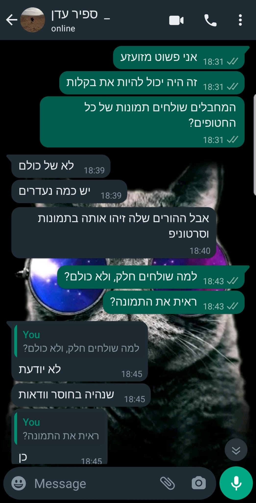
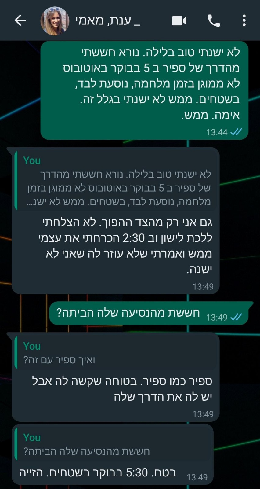

# חרבות ברזל, יומן מהעורף.

## השבת הארורה, היום ה-1 למלחמה (7-אוקט-2023):

#### המסיבה הגדולה מתחילה בלעדינו.

סוכות. אנחנו בסופו של שבוע טיול ג'יפים לרומניה. התחילו את המסיבה ואפילו לא טרחו לחכות לנו.

ביום השביעי והאחרון לטיול. טילים, חטופים, הרוגים, ועוד מריעין בישין.

ענת מתעוררת בבוקר, ברומניה, ורואה התראות של פיקוד העורף. ואנחנו בחו"ל. הזייה!

אני מחליט להוריד את הדגל מהג'יפ שלנו (ברומניה). שלא נזוהה כישראלים בחו"ל.

עידן מתקשר ומודיע שאנחנו ממש לא מבינים מה שקורה בארץ.

עידן אומר שדבר כזה העולם עוד לא ראה.

עידן מספר שהגבול עם עזה התעדכן.

לרעתנו. (בכל פעם שאני קורא את המשפט הזה, שכתבתי, משהו עולה לי בגרון)

ששלושה בסיסי צה"ל התאדו. שהבסיסים עכשיו שרופים, ובשליטת החמאס.

שקיבוצים נשרפו והתרוקנו. והתושבים כבר עשו רילוקיישן לעזה. (בני ערובה.)

לדעתי עידן התבלבל וצפה בעונה 19 של פאודה.

התחושה שלנו: עירפול. אנחנו בח"ול. רחוקים. חשים שחסר לנו מימד. אנחנו כל כך רחווווקים מהכל.

עידן אומר שזה יום כיפור אול אובר אגיין.

ואני בטוח שעידן מגזים.

שבת היום. עידן הוקפץ. זה חריג. לוקח את הרכב, ומחנה אותו ליד היחידה שלו. רושם צה"ל על מנת לא לקבל דוח. ענת מבקשת שנשאר ברומניה עוד מס ימים.

אבל אני חש שייכות גדולה מדי לארץ. להיות יהודי זה גם אומר לא לנטוש כשקשה.

חברת התעופה מבטלת את הטיסה שלנו ארצה. ואז שוב מחזירה אותה לטיסה סדירה.

לאחר תלאות נפשיות [[אבל על כך בפוסט אחר]](https://edenguy.wixsite.com/blog/post/%D7%98%D7%99%D7%A1%D7%94-155) אנחנו מגיעים ארצה.

היום לא היו לנו אזעקות.

ענת והילדים ישנים בממ"ד.


## יום 2 למלחמה (היום הכי קשה)

אני מרגיש כמו הילד הזה, בכיתה א', שלא בא לבית הספר ביום הראשון, וכל השנה הוא מרגיש שפספס משהו, ושואל: "נו, אז מה היה ביום הראשון?"

אנחנו שומעים שתצפיתניות מאוגדת עזה נכלאו בחדר, שרפו אותן, ואז בוצע ווידוא הריגה. ליתר בטחון. מעניין ממי הם למדו את זה.

ספיר, התצפיתנית שלי, מספרת שהייתה מתקפת סייבר על המצלמות.

לתצפיתניות לא היה חוזי.

וכשהמצלמות עלו, התצפיתניות ראו ערימות של מחבלים חוצים את גדר ההפרדה.

באותה שעה גם הייתה מתקפת סייבר על הקשר.

התצפיתניות לא יכלו להזעיק תגבורת, כי הקשר הותקף.

היתר היסטוריה.

ספיר עברה קורס תצפיתניות לפני חצי שנה.

ספיר הוצבה באיוש. באותה הצלחה הייתה עלולה להיות מוצבת בעזה.

האחוזים לכך מבהילים אותי.

ביקום מקביל, יש לי בת חטופה בעזה עכשיו.

או גרוע מכך.

מקיימים בעבודה ישיבה של כל הסייט הישראלי.

אנשים פורקים את שעל ליבם.

- אני מחכה לצו 8. ואני מקבל משימות מהמנהלים שלי. ומה אם אני מת בקרב? אף אחד בעבודה לא יידע שנפלתי בקרב. אנשים במשרד לא יראו אותי כמה שבועות, ופשוט ישכחו שהייתי קיים.

- האם החברה תמשיך לשלם לנו משכורות? גם אחרי חודש או חודשיים לחימה, כשאנחנו לא אפקטיביים? איך נשלם עבור הגן והמשכנתא?

- יש לי ישיבות עם לקוחות. היום עליתי לישיבה, אבל אמרו לי שהישיבה בטלה ומבוטלה כיוון שהלקוח שלי שבויי בעזה.

אין עין אחת שנותרת יבשה בשיחה הזו.

זה נוראי ומזעזע.

מעולם לא חוויתי רגשות בעצמה כזו.

ב-9-11 אולי.

אחרי השיחה המזעזעת הזו אני מתקשר לעידן. מספר לו על התכנים שעלו בישיבה. לא יכול לעצור את הדמעות. בוכה לו בטלפון.

זה היום שהכי קשה לי נפשית.

ילד לא אמור לראות את אבא שלו נשבר.

או שאולי כן?

מבקשים בחדשות שנסתגר בבתים, שמחבלים בטנדרים מסתובבים בכבישי הארץ.

מצאו טנדר עם מחבלים קילומטר וחצי מהבית שלנו.

אני מכסה את החלונות שפונים לרחוב בקרטון. שלא ייראה אור מהרחוב.

אלה דברים שסבא שלי עשה במלחמת העצמאות. כשהפציצו אותם מהאוויר. האפלה.

פיקוד העורף יוצא בהודעה חריגה שאני בטוח שלא נוסכת עודף בטחון בשום בית אב בישראל.

"הודעה חריגה" לאזרחים: בפיקוד העורף קוראים הערב לאגור מזון יבש, מים ופריטים נוספים ל-72 שעות. הקריאה פונה לכל האזרחים.

אלו ההנחיות

◾ מלאי מים של 3 ליטרים לאדם ליום, למשך 72 שעות

◾ מלאי מזון יבש ומשומר

◾ אמצעי תאורה או פנס המופעלים על סוללות

◾ אמצעים לקבלת התרעות ועדכונים - רדיו הפועל על סוללות וסוללות ניידות לטלפונים ניידים

◾ תרופות

◾ ערכת עזרה ראשונה

◾ מסמכים אישיים, תעודות וכסף מזומן

פורטוגל תאפשר לישראלים לבקש ויזת פליט. אני שוקל הגשת מועמדות.

המשפחה בכוננות ספיגה.

אני מכין 400 ליטר מים.

הולך למלא דלק פול טאנק ברכב המשפחתי.

כוננות ספיגה על אמת.

ליאור כותב איגרת לחיילים

אני מתקשר לספיר. ספיר מעדכנת שחדרו ליישובים בגזרה השכנה שלה. אני רואה שחור בעיניים. לא טוב לי.

אני בפאניקה. האם יעשו העתק הדבק למתקפה על התצפיתניות בעזה?

מפלס הלחץ עולה ועולה. מבעבע. עומד להתפקע. קשה להכיל את האימה.

אני מתקשר לעידן. עידן אומר שאם בתקשורת אומרים להתארגן על סוללות ונרות, זה אומר שחיזבאללה מצפון וגם איראן, כולן מוזמנות למסיבה.

מפלס הלחץ מגיע לנקודת רתיחה.

לא יודע מה לעשות עם עצמי.

זה רק היום השני. והעתיד נראה לא וורוד בכלל.

מחר יהיה יותר טוב. אני משקר לעצי.

ענת והילדים ישנים בממ"ד.

היום היו 3 אזעקות.


## יום 3 למלחמה

כל כמה שעות אני עושה צ'קאין עם עידן. ועם ספיר.

ספיר מספרת ששלחו את כל הסדירניקים לדרום.

שומרים עליהן שני מילואימניקים.

זהו. עכשיו נרגעתי...

ספיר לא מצליחה ליצור קשר עם חברה שלה מקורס התצפיתניות, מאוגדת עזה.

ענת ואני כבר יודעים מה עלה בגורלה. אבל לא רוצים לספר.

ספיר נותנת לנו שם, ומתחננת שנברר מה עלה בגורלה.

ספיר לא יודעת דבר וחצי דבר על גורל התצפיתניות.

כואב לנו הלב. ואנחנו לא מספרים לה שהחברה שלה נפלה בשבי החמאס.

תורים אינסופיים של אנשים שרוצים לתרום דם. מחמם את הלב. גם עדן עומדת בתור לתרום.

נוסע לתחנת דלק להצטייד בעוד מים. ועוד מזון יבש.

מכין קרש עץ לממד, שלא יוכלו לפתוח את הדלת מבחוץ.

הילדים לא מבינים בשביל מה זה.

אני מעדיף שימשיכו לא להבין.

אבל אני לא מרוצה מהקרש הזה. הוא לא אמין.

היום האזעקה תפסה אותי באמצע סט. קטעה לי את האימון. זה כבר הרחיק לכת מדי.

בת הדודה שלי סטייסי, מפילדלפיה, עולה מולי, ודורשת עדכונים. מה קורה בישראל? כמה אנחנו רחוקים מגראונד-0?

אני פותח קב ווטסאפ משפחתית מולה, וזורק לה עדכונים.

היא פשוט מזועזעת. מזמינה את כולנו אליה. יש מקום.

ענת והילדים ישנים בממ"ד.

היום היו שתי אזעקות.


יום 4 למלחמה

עידן הגיע הביתה היום, להחזיר הביתה את הרכב, החליף תחתונים וברח בחזרה ליחידה. בילה עשר דקות בבית.

הוא אומר שהוא לא מבין איך אנחנו פשוט יושבים בבית ומחכים שהמצב יעבור. איך אנחנו לא שותפים. תורמים למאמץ המלחמתי, עושים, נלחמים.

פשוט יושבים בבית מחכים לזמנים טובים. הוא מול מקלדת 19 שעות ביום. 20 אולי. כבר שבוע. נלחם. הוא מוקף אנשי עשייה 24 שעות ביום

פתאום מגיע הביתה ורואה אנשים מסתכלים\בוהים בקירות.

כלומר, הוא מבין שאנחנו אזרחים, ולא מצופה מאיתנו, אבל הוא במוד של 180% cpu במשך שבוע, ופתאום רואה את שני ההורים ה brain dead שלו בבית, וזה צורם. הניגוד.

אני מספר לעידן שרציתי לבשל 100 מנות חמות ולהביא לספיר, ליחידה שלה. אבל היא אמרה שיש מספיק אוכל בחדר האוכל.

יצא לי לחשוב על מה שעידן אמר, ואני מחליט להתנדב לעזור לחקלאים שקיבלו צו 8.

חסרות ידיים עובדות בחקלאות. סחורה לא נאספת מהשדה. כואב הלב. זה אוכל טוב. שנזרק.

הייתי רוצה לעזור איפה שצריך באמת. בישובי העוטף. אבל ענת מטילה ווטו.

אני יוצר קשר עם לקט ישראל. וקובע איתם למחר.

ספיר מקבלת תמונה של החברה שלה אזוקה בשבי החמאס. נשבר לנו הלב, שככה היא מגלה על חברה שלה.

גאלית, חברה מהיסודי מתקשרת היום, להודיע שאסף, חבר כיתה קיבל הודעה שהבת שלו חיילת שנורתה בשנתה באוגדת עזה

אסף גרומן שבור רצחחחח




נועה מרציאנו, החברה החטופה של ספיר, מוחזקת במחילות החמאס


גאלית מסתתרת בחסות גדר ההפרדה בכביש, בזמן אזעקה.


יום 5 למלחמה

יוצא השכם בבוקר לקניות.

המדפים בסופר די ריקים.

אין משלוחים, אין עובדים בסופר, אין סחורה, רק קופאיות.

המדפים ריקים. כמו במזרח אירופה בימי הקומוניזם.

אחה"צ הגיעה תלונה למשטרה מאחד מתושבי השכונה על איש חשוד שהולך מחוץ לשכונה, בדיונות החול, עם תיק גב גדול.

כשאני יוצא לאימון ראקינג (תיק גב גדול במשקל 30 קילו, הליכה בגבעות החול שליד הבית). ניידת משטרה עוצרת אותי, ומבקשת פרטים. משחררים אותי מייד כמובן. אבל אפשר ללמוד על העצבנות והחרדה של התושבים.

כשאני מספר לספיר על התקרית, היא מתגלגלת מצחוק.

שמח שהצלחתי להצחיק אותה.

ענת מדפיסה מנדלות, וצובעת עם הילדים.

אני משתף את הבוס שלי בקשיים שלי, אומר לו שאני לא אפקטיבי בעבודה כתמול שלשום. הוא מקבל בהבנה מלאה.

ספיר מספרת לנו שהבנות במשל"ט החליטו לשמור שבת לזכר\לכבוד הבנות התצפיתניות שנטבחו\נחטפו.

שלא ננסה להשיג אותה בשישבת, כי הטלפון שלה לא יהיה זמין. הן שומרות.

רק זה חסר לי. שספיר תתחיל להתחזק.

מדמיין את עצמי הולך ל"אושר עד" לקנות כלים חד פעמיים, כי אחרת ספיר לא מסכימה להסב עימנו לשולחן השבת.

רק זה חסר לי!!!

ספיר מרגיעה אותי ואומרת שזה חד פעמי.

אני לא רגוע. כל חוזר בתשובה מתחיל בחד פעמי.

חשבתי על אפליקציה.

```
במקום לשאול את כולם אם הכל בסדר, לאחר אזעקת טילים.
אני נרשם,
מסמן מי אני רוצה לדעת שהוא בסדר.
אחרי אזעקה, אני מסמן שאני בסדר.
ואז יכול לראות מי מהחברימשפחה בסדר, ומי לא הגיב.
תהיה מטריצה יפה שלאט לאט אסינכ מתמלאת ירוק. 
ואחרי 5 דק נקבל נוטיפיקציה מי לא הגיב. 
פאב סאב הכי פשוט.
(האפליקציה גם תגיד למי סוללה נמוכה או מחוץ לקליטה ולכן לא הגיב. וכל יוזר יצטרך לאשר את העוקבים שלו. פרטיות. ) 
חשבתי על זה לפני 15 שנים, בפיגועים.
אבל עכשיו זה רלוונטי יותר.
יום עבודה, להרים את זה.
יהיה להיט.
ריאקט, aws. 
```

החברים מתלהבים מהרעיון. ענת פחות.

היום היו שתי אזעקות.

ענת והילדים ישנים בממ"ד.


יום 6 למלחמה

מתעורר ב 3 לפנות בוקר. לא מצליח להירדם. השינה נודדת.

מתכתב עם החבר בראל.

הוא שואל אם אכניס את השיחות איתו ליומן המלחמה שלי.

אז הינה. מכניס.

בראל מפטרל ביישוב שלו עם נשק. לכן הוא זמין ב 3 לפנות בוקר.

אני שואל אותו איך עדות המזרח כאלה חמים, אוהבים, לבביים, אבל הערבים כאלה מרושעים ואכזריים.

לוקח לו הרבה זמן לענות, ואני חושש שמא הוא נעלב שאני משווה בין עדות המזרח לערבים.

אבל אני דווקא התכוונתי בקטע טוב.

בראל מספר על מופע לג בעומר שנחרט בזכרונו מהילדות, בו בחור ערבי התעלל ביונים, הדליק אותן, תקע בהן נפצים.

אכזריים הם הערבים.

בראל שולח תמונה עכשיווית שלו. מהפטרול הלילי שלו.

ואני ממליץ לו להתגלח בהול, שלא יעצור אותו פטרול של משמר הגבול.

אני מצטרף לפורום "אחים למשק". מחפש אפיקי התנדבות בחקלאות. שואלים אם אני יכול לעזור בחליבה.


מצטרף לפורום אחים למשק.


יום 7

07:00 עדי(אחותי) מתקשרת.

לפי השעה, אני מבין שמשהו קורה.

עדי, בקול רועד, מספרת שהבת שלה, מיי, ששוהה מזה שנה וחצי באוסטרליה, החליטה לחזור לארץ, להלחם. הבית שלה במשך שנתיים ושמונה חודשים (בסדיר שלה) הושמד. (חטיבת עזה) והיא לא יכולה לעמוד מנגד ולהיות פאסיבית.

עדי חרדה. מנסה לשכנע אותה לא להגיע.

אבל מיי החליטה.

אבא מתקשר. אנחנו מדברים.

אבא - "איך לא למדנו כלום ממלחמת יום כיפור"

אני - אני יכול להבטיח לך שמלחמת יום כיפור תקרה פעם שלישית גם לנכדים, בעוד 50 שנה. אין אפשרות לשמור הרמטית על קו גבול 200 שנה. דברים קורים. ויקרו.

אבא - אני צריך להחליף את שר החינוך. ילדי ישראל לא יודעים היסטוריה. איך זה שהנכדים שלי לא יודעים היסטוריה? ולמה הילדים שלי לא יודעים שום דבר שקרה לפני שנת 2000.

אני - מתעצבן, לא בא לי לקבל על הראש ממי שמתעתד להחליף את שר החינוך, ומנתק את השיחה.

אומרים שכלבים פיתחו התנייה לאזעקה, ורצים ראשונים לממ"ד בעת הישמע אזעקה.

רק שוקי, הכלב שלנו חצי חרש, ולא ממהר לשום ממד במעמד האזעקה.

היום היו שתי אזעקות.

ענת וליאור ישנים בממ"ד.


יום 9 למלחמה

טוב, היום גשום ממש. מתקשר ללקט ישראל, וקובע למחר. מחר בטוח.

אני קונה בריח לדלת הממד. מתקין בריח. במקום הקרש השנויי במחלוקת. מראה לליאור איך לוחצים ניטים. מסביר לו מה ההבדל בין מקדח קיר למקדח ברזל.

הילדים לומדים מרחוק היום. בזום.

ענת משחקת המון משחקי קופסא וקלפים עם הילדים כל יום.

היא גם מאד נהנית מזה. פיצויי על כל השנים שלא הסכימה לשחק משחקים.

הילדים מתמכרים למשחקים עם ענת.

מיי מתגייסת.

היום שתי אזעקות

ענת ישנה עם ליאור בממד.


יום 10 למלחמה

היום זה היום בו אני חקלאי ליום אחד.

אני הולך לעזור בחקלאות.

שדה גדול מימדים בראשלץ. אוספים קולורבי.

יש המון מתנדבים. מכל הארץ. מכל הגילאים. מחמם את הלב לראות את רוח ההתנדבות בעם.

אנו מתבקשים לקטוף את הקולורבי, להוריד את השורש ואת העלים, למלא דלי, וכשהדלי מלא, למלא את המיכל הגדול. הקונטיינר.

אחרי שלוש שעות כולם עייפים. אך מרוצים.

אני חוזר הביתה ומנסה לבדר את ליאור. אנחנו ממלאים קערה גדולה במים והמון קרח.

טובלים את הראש בקערה. יש לכך סגולות רבות. מעורר את המערכת הפארסימפטתית, משחרר אנדורפינים, משפר את המער' החיסונית.

מסתבר שבצידי הראש יש קולטני קור. ולכן לטבול את הראש במי קרח זה כמעט כמו אמבט קרח לכל הגוף.

שנינו מקבלים בריין פריז.

אנחנו גם עושים אתגר dead-hang במתח. להיתלות ל 100 שניות.

אני צולח 100 שניות. בקושי. ליאור מצליח דקה. שזה מרשים ביותר.

ענת מכינה עם הילדים בורקס גבינה ותפו"א.

אני רוצה להכין כדורי שוקולד עם ליאורי, אבל אין לנו ביסקוויטים פתי בר.

עוד הודעה מכמירת לב מספיר.


יום 11 למלחמה

ליאור שולח אותי לבית הספר שלו להביא לו ספרים ומחברות שהשאיר שם לפני המלחמה.

בית הספר נטוש וריק. כמו בימי קורונה.

אני קונה פתי-בר. היום נכין כדורי שוקולד יחד.

החבר שלי, גורי, מגלה שהמחבלים שחדרו לישראל לפני 11 ימים היו מסוממים.


יום 12 למלחמה

ארגון הטרור חמאס הודיע היום כי בכיר הזרוע הצבאית איימן נופל חוסל על ידי צה"ל במרכז רצועת עזה, חיסול מדרג אחר והמשמעותי ביותר עד כה • הוא היה אחראי על התיאום בין הגדודים השונים של ארגוני הטרור ברצועה

היום קיבלנו 7 אזעקות. חיסולו של איימן מסביר את זה.

בלילה ליאור נכנס להתקף חרדה. רעידות, נשימה שטחית.

ענת עובדת איתו על תרגילי נשימה.


אני נתקל בסרטון ווידאו ממצלמת האבטחה של קיבוץ בארי. רואים איך נכנסו לשם ערימות של מוסלמים.

זה היה נראה כמו כיכר בעזה. לוחמים, ילדים, אנשים זקנים ונכים, נערים. הכל מהכל.

זה היה כמו יום של טיול שנתי. כל אחד נכנס וחוצה את הגבול לישראל, לוקח איתו יהודון מזכרת, לקשור בסלון, וחוזר לעזה, אחרי התעללות בתושבים המקומיים.

יום 13 למלחמה שוקי לומד לרוץ איתנו לממד.

אנחנו לא בטוחים אם הטריגר הוא אזעקה, או שהוא רואה את כולנו רצים בלחץ למרחב המוגן.

מחליטים לנסות.

סופרים לאחור 3..2..1... ורצים יחד לממד.

שוקי דוהר איתנו.

זה סופי. הכלב חירש.

... מסתבר שיש כמה עשרות מחבלים של החמאס, שמסתובבים בארץ.

ערביי ישראל נותנים להם אוכל. וחסות.

אם יש משהו מלחיץ... זה זה.


[זה החומר ממנו עשויים הסיוטים שלי](https://edenguy.wixsite.com/blog/post/%D7%A7%D7%9C%D7%90%D7%A5-%D7%91%D7%9E%D7%98%D7%A2-%D7%94%D7%90%D7%A0%D7%95%D7%A0%D7%95%D7%AA). עשרות מחבלים מסתובבים בישראל.

כל כמה חודשים הסצנה הזו רודפת אותי בחלום. אני איכשהו בסוף החלום מוצא את עצמי נמלט על נפשי ממחבלים חמושים.

אבל עכשיו זה ממשי.

ויש עדויות של אנשים שנלחמו על ידית הממ"ד במשך שעות מול מחבלים נחושים מצידה השני של הדלת.

ולאור כל זאת, והלחץ ששוב נבנה אצלי, אחרי רגיעה בשבוע האחרון, אני מחליט לשפר את הבריחים בממד.

יש לי בריח אחד, ואני מעוניין להתקין עוד שלושה.

זה יקנה לי מעט שקט נפשי.

אני יוצא לטמבוריה השכונתית, אבל כל הבריחים נחטפו. הולך לאייס, והבריחים לא מספיק מאסיביים.

הום דיפו... גם.

בסוף אני מתייעץ עם בר-אל, החבר בראל שמביא לי בריחים בריאים, ויחד אנחנו מתקינים בריחים.


יום 14 למלחמה

אני שוקל הוצאת רשיון נשק.

אלה זמנים מטורפים. בחיים לא חשבתי להוציא אישור החזקת נשק.

לצערי אני לא עומד בתנאים. אני רובאי 02. הקריטריון הוא 03. או יישוב קו עימות.

אני מתנחם בכך שראשלץ תהיה תוך שבוע וחצי יישוב קו עימות. ואז ארוץ להוציא רשיון החזקת נשק.

לספיר יש יוקליילה. היא מעלה את מוראל הלוחמים ביחידה עם היוקלילה שלה.


ספיר מספרת שהורו להם להתכונן נפשית ל-60 יום בבסיס.

לא ממש ברור לי איך אפשר להכין את עצמך נפשית לכזה דבר.

מדברים על זה שערבים ישראלים מסתובבים בעיר, בכל מני ערים. גם תא. ומצלמים בתים.

עשרות פוסטים על כך בפייס.


השקל מאבד מערכו.

יום 15 למלחמה

היום יום חג בבית.

עידן מגיע ל-24 שעות התרעננות.

אני אוסף אותו בתחנת הרכבת.

שמחה גדולה. סוף סוף הבן האובד שב הביתה.


עידן משתף מתלאותיו ביחידה.

חוויות שכאלה אני בטוח שלא יחווה בשום מקום אחר. בשום זמן אחר.

מקיימים ארוחת ערב שישי לכבודו של עידן.

ספיר חסרה לנו.

היום ירו 3 טילים מתימן אל עבר ישראל. הגזרה ללא ספק מתחממת.

שיגור שלושת הטילים ו-15 הכטב"מים של החות'ים לעבר ישראל, והפגיעה בהם על ידי הספינה האמריקנית, הם מימוש האיומים וההבטחות של השבוע האחרון. עם זאת, הירי מגביר את הסיכוי שגם חיזבאללה יצטרף למלחמה | פרשנות

ביום ה-13 למלחמה, נכנסו אליה איראן וארה"ב. בטהרן מימשו כמעט מילולית את איומיהם להרחיב את המלחמה לזירות נוספות, והאמריקנים מימשו את הבטחתם לסייע לישראל גם מבצעית אם יהיה צורך - לא באמצעות חיילים על הקרקע אלא ביירוט טילים וכטמ"מים שמשוגרים על ידי שלוחי האיראנים מאזורים שאינם סמוכים לגבול ישראל.

חיילים אמריקניים לא ילחמו על הקרקע בישראל ועבורה, אבל ארה"ב תסייע להתמודד עם מטחי טילים מהאגפים הרחוקים של הציר השיעי הרדיקלי.

יום 16 למלחמה

הבוקר קיבלנו אזעקה ב 09:00 בבוקר. זה חריג.

נראה שצהל השתלט על צפון הרצועה, והם יכולים לירות רק מדרום הרצועה.

אנחנו תל אביב החדשה. נראה שכבר אי אפשר להגיע לתל אביב. אנחנו המטרה הכי צפונית.

העוזרת שלנו אומרת שאנחנו לחוצים מדי, כי יש המון זמן להגיע למרחב המוגן.

ליאור מבקש להצטרף איתי לשגרת האימונים שלי בחצר.

שמים את הפלייליסט האהוב שלו, ומתאמנים יחד. אימון ידיים היום.


סטייק ולובסטר. על סיפון נושאת המטוסים ג׳ראלד פורד בים התיכון הוגשו אתמול בערב סטייק ולובסטר. הימאים יודעים שמגישים מנה כזאת בחגים - או כדי להעלות את המוראל לקראת יציאה לפעולה.


ליאור התעורר הלילה מחלום בלהות.

ובחלומו הוא אוכל עוגייה. עוגיית גרנולה שהכין עם אמא ועם איתי. בחלום נשמעת אזעקה. וזו אזעקה מיוחדת, שמאפשרת רק חצי דקה זמן לממ"ד, ולא דקה וחצי. ליאור טס לממד, כשהעוגייה בפיו. מרוב לחץ, ליאור נחנק מהעוגייה היבשה. אבא (אני) עושה לו היימליך, מציל אותו, והעוגייה יוצאת\מתעופפת לו מהגרון. אמא רואה את העוגייה יוצאת בשלמותה מהגרון של ליאור ומתעלפת. ואז התעוררתי.

יום 17 למלחמה

מתעורר ב 02:00 ולא מצליח לשוב ולהרדם.

כל הקווים האדומים שלי נחצו.

לא מוכן לחיות כאן יותר.

ניסינו. באמת שניסינו.


קובע לספיר תור לחידוש דרכון אמריקאי בקונסוליה האמריקאנית ברחוב הירקון.


היום הוא יום שמח.

ספירוש מגיעה הביתה להתרעננות.

ההנאות הקטנות של החיים.

ספיר מגיעה ב 14:00. וצריכה כבר לצאת בחזרה לבסיס מחר לפני 07:00 בבוקר.

אני לוקח אותה לקניות. השלמת ציוד. גופיות טרמיות, מעיל, גרביים. ריקושט גוזר עלינו קופון.

קופון שמן.

ספיר מספרת אנקדוטות.

לא נראה שהיא השתנתה.

התנהגות די רגילה.

אין הפרעת דְּחָק פוסט־טראומטית.

אע"פ שהיא מספרת על ה מ"מ מהטירונות שנרצחה, ועל חברות תצפיתניות שנרצחו, או נחטפו.

אבל נראה שזה עובר מעליה, ולא משאיר משקעים.

מאמין שדברים יצוצו בעוד שנים.


יום - אני מפסיק לספור ...

מנת המשכל באוכלוסייה מתפלגת ממוצע 100 וסטיית תקן 15.

בעזה הממוצע הוא 85, עם אותה סטיית תקן.

כלומר, מתוך 2 מליון עזתים יש 120 חבר'ה עם 145 IQ, שמוגדרים כגאונים.

אני מאד בחששות מכניסה קרקעית. אני בטוח שמחכות לנו שם הפתעות שהמודיעין המטורלל שלנו לא מסוגל לצפות.

ה-120 גאונים העזתים בטוח הטמינו לנו מלכודות.

יום רודף יום.

הייאוש גובר מיום ליום.

ונמאס לי לעדכן ביומן.

ענת וליאור עדיין ישנים בממ"ד

ה-31 באוקטובר, היום ה-20 למלחמה

מתעורר בבוקרו של ה-31 באוקטובר. משפשף את העיניים, ויורד למטה, לסלון.

רואה שרשרת בלונים תלוייה בסלון.

ולא ממש מבין מה קשור.

אה, ואללה. יום הולדתי היום.

שכחתי.

הופתעתי.

נחמד לי לקבל תשומת לב.


לכבוד יום הולדתי אני מחליט לצאת לריצת שטח בשטח הפתוח.

ענת מזהירה שבשטח פתוח לא מיירטים טילים.

אני מתעלם.

יותר חשובה לי השפיות שלי.


בצהריים, לאחר ישיבה בעבודה, ליאור קורא לי לבוא רגע למטבח. אני מגיע, ושרים לי יום הולדת שמייח, גם יש עוגה.

מאחר ורק אני יוצא לקניות כבר חודש, בלי לדעת לאיזו מטרה, קניתי מה שהיה ברשימת הקניות: ביסקוויטים וגבינה לעוגת גבינה.

עבדו עליי.

אחר הצהריים אני נוסע לדקטלון, קונה שק איגרוף אדום, תולה בחצר, כותב עליו "חמאס" בטוש שחור.

עכשיו הילדים מוציאים המון אגרסיות על חמאס. האמוציות מהחודש האחרון, כל האזעקות, התסכול. הכל יוצא באגרופים שלופים.

זה אחלה דבר. סיפוק רב, לבעוט בחמאס. תראפואטי.


היום ה-30 למלחמה

ספיר מגיעה הביתה ליום וחצי. פעם ראשונה שהיא יוצאת לכל כך הרבה זמן מהמשל"ט.

אנחנו מרגישים שלמים שוב.

ספיר נראית טוב. נראית ממש חזקה. האירועים הקשים מנשוא לא השפיעו עליה כמעט.

אני מרוצה.

מאד.


אני לוקח אותה, ואת הצעירים לאכול גלידה. ב"אנדרי".


ענת אוהבת את התמונה הזו. פטריוטית. מדים ודגל.


עידן שולח לי הודעה בווטסאפ.

מה קשור פתאום?

איך שוב רגרסיה ליום השני של המלחמה?

אני שוב נכנס לכוננות ספיגה, מחליף את המים בממ"ד. משלים חוסרים.


אני שוב בסרטים. לא ישן טוב בלילה.

מאיפה עידן הגיע עם החרא הזה פתאום?

מנסה לדלות מעט יותר פרטים. אבל עידן בונקר.

אף מילה.

והינה ידיעה נוספת שמזכירה לי את מלחמת יום כיפור:

ברקע המלחמה מול חמאס, ירדן הודיעה על כי תחזיר להתעייצויות את שגרירה בישראל,

מנהיג החות'ים במסר מאיים לישראל. עבד אל-מלכ אל-חות'י, מנהיג המורדים בתימן שנתמכים על ידי איראן, אמר כי "העם התימני לא יהסס להכריז על ג'יהאד נגד ישראל"

היום שיגורי טילים שביצעו החות'ים, המורדים מתימן לעבר הים האדום.

הגפרור שהוצת בתימן עלול לחייב את סעודיה וארה"ב לרדת מהגדר.

אין ספק שהגזרה מתחממת.

מי שמע על החות'ים האלה בכלל, עד היום? מאיפה זה הגיע? תימן? זו מדינה אמיתית, בכלל?

לראשונה אי פעם קרוב למזרח התיכון: כלי השיט הגדול והיקר בעולם. 90 כלי טיס, 4,300 אנשי צוות וצוללות חמושות: ארה"ב מקרבת לחופי ישראל נושאות מטוסים במפגן תמיכה במלחמה מול חמאס נושאת המטוסים "פורד", כלי השיט הגדול והיקר בעולם, כבר הוצבה בים התיכון, ובשבוע הבא צפויה גם לעגון "אייזנהאואר"


סיילספורס האמריקאית, מעניקה לעובדיה הישראלים בונוס מלחמה. עובדי החברה יקבלו מענק חד-פעמי בגובה של 10,000 שקל למשכורת של חודש נובמבר

כיף לדעת שרואים אותנו. שחושבים עלינו.


ענת לא מגיעה לחלון הממ"ד לסגור אותו. לכן אני מתקין מיתר כביסה עם גלגלת, שמקל על סגירת חלון הממ"ד.

ענת לא מתרשמת במיוחד.

ליאור אומר שהוא רוצה להצטרף לשגרת האימונים שלי.

דבר טוב אחד יוצא מהמלחמה הארורה.

ליאור מצטרף אליי, ואנחנו מתעמלים יחד.

לליאור יש גוף טוב. מוצק. אם הוא טיפה משקיע בעצמו ומתעמל, הוא הופך למפלצת.


השבוע סוף סוף אני נוסע למשרד בתל אביב.

קצת שפיות.

קצת חדר כושר עם אנשים עם דופק.


מאד נחמד לי להפגש עם אנשים.

שיחות מסדרון.

חסר לי מאד.

בדרך חזרה נחשף פעם ראשונה לשלטי חוצות עם תמונות חטופים.

מטלטל.


מקום העבודה מאפשר לנו לדבר עם איש מקצוע על הקשיים, המשברים, החרדות.

ענת ואני מתחברים בזום עם כמי המטפלת.

היא ממש בחורה לעניין. בשיחה אנחנו מחליטים בהדרגה לצאת מהממ"ד, לצאת מהבית, אולי הילדים יילכו לצופים. לחברים, לבית הספר. כמי ממש עזרה לנו.

לא חשבתי שמפגש זום אחד עשויי להיות כזה אפקטיבי.

אמא של ענת מגיעה לביקור קצרצר, וטועמת את טעמו של הממ"ד שלנו.


ענת מכריזה שהלילה היא תישן בחדר השינה, וליאור ישן בחדר שלו.

התרגשות. אחרי 30 יום של שינה בממ"ד.

לכבוד האירוע קיבלנו שתי אזעקות ליליות. אחת ב 21:00. ואחת ב 22:00.

ליאור מצהיר שישן מעולה.

השביע את ענת שאם יש אזעקה, היא מעירה אותו דבר ראשון, ולא שוכחת ממנו.


אנחנו מככבים במקום 3. אחרי שדרות.

מכובד.

עודד האמיץ מגיע לראשלץ מוכת הטילים לבקר אותי.

אנחנו מכינים מטעמים על המנגל, ומדסקסים ענייני מלחמה.


7 בנובמבר. חודש למלחמה.

ליאור לובש חולצת בית ספר פעם ראשונה מזה חודשיים.


בית ספר.

העורף מתחיל לחזור לשגרה.


אני נוסע למשרד בתל אביב.

שגרת עבודה.

פתאום, מכריזים בכריזה על דקת דומייה בשעה 11:00 לזכר הקורבנות.

עומדים דקה דומייה.

מה, עבר רק חודש? נשבע שזה מרגיש כמו חצי שנה.

מחלקים לנו דיסקיות לזכר השבויים והנופלים.


כולם בסולידריות


השבוע החמישי למלחמה - שבוע נועה

#### יום ד' 14 בנובמבר. יום הולדתה של ענת.

היום הנוראי ממנו חששנו הגיע.


על הבוקר, ספיר שולחת לי ווידאו סנאף שפרסם החמאס, המראה שנועה מרציאנו נהרגה מהפצצות צה"ל.

ספיר פוחדת להסתכל בווידאו, ומבקשת ממני לצפות, ולספר לה מה מוצג שם.

אחרי הסתכלות, אני מודיע לספיר שאני חושב שהכל פייק ציני של החמאס. לא אמין בעליל.

לאחר כשעתיים, ענת, בריצה, מגיעה אליי, בוכייה. גילתה שנועה מרציאנו נרצחה בשבי החמ"ס.

הנורא מכול קרה.

יופי של יום הולדת אירגנו לענת.

אנחנו מתקשרים בחיל ורעדה לספיר. מוסרים לה את הידיעה הנוראה.

ספיר מספרת לנו שנועה כתבה לה מכתב בטירונות, וביקשה ממנה לא לקרא עד אחרי הטירונות.

ספיר שכחה מזה עד היום.

כל המשפחה עכשיו בחיפוש אחר הפנקס השחור הקטן שבו נועה מרציאנו כתבה מכתב חשוב לספיר.

לא מוצאים :(

ענת ואני מסתובבים כל היום כמו זומבי.

בלי חשק לכלום.

אני רק מתאר לעצמי מה שעובר על ספירוש שלי.

זה יום מאד קשה עבורי. עבורנו. אחד הקשים.


מאחר ואין גופה, המשפחה יושבת שבעה, בלי הלוויה.

אנחנו קובעים ללכת עם ספיר לניחום אבלים במודיעין ביום חמישי.

כנראה שהצעדה של משפחות החטופים שהיא בדרך לירושלים תעבור אצלם בדיוק בחמישי בצהרים


חמאס, ארגון טרור, הנחית על המעצמה הישראלית את המכה הצבאית הקשה בתולדותיה. תרגיל ההונאה היה מושלם. ההחמצה של המודיעין הייתה מוחלטת. התוצאות היו הרות אסון, ורק עוצמת ההשפלה גברה על הכישלון. ישראל עמדה במרחק נגיעה מהסכם שלום היסטורי עם סעודיה, שהיה משלים את מעגל השלום עם הציר הסוני, כולא את הפלסטינים בתוך קופסה שחורה וזורק אותה לים.במקום זה, הם כמעט זרקו אותנו לים. המעבר שעברנו במהלך אותה שבת, 7 באוקטובר, הוא אחד המעברים החדים בהיסטוריה. בבת אחת הפכה האימפריה הישראלית ממעצמה שאננה, יהירה ובוטחת, שמפליאה את מכותיה באיראן, בסוריה ובכל מה שביניהן, שמעניקה את חסדי המודיעין שלה לכל מחזריה, שמכתיבה את הקצב במזרח התיכון כולו ומהווה מגדלור של טכנולוגיה, עוצמה ומודיעין לעולם כולו, לספינה טרופה בין הגלים, אומה בפאניקה קיומית, אזרחים שמנסים לקושש לעצמם אקדח או סכין כדי לישון איתם תחת הכרית בלילה, גם אם הם גרים בלב תל אביב.

הזמן קופא. מלכת כל יום מרגיש כמו ה-7 באוקט.


#### יום ה'

היום נסענו עם ספיר למודיעין. לבית משפחת נועה מרציאנו. לניחום אבלים.

אמא שלה עושה רושם של אישה מאד מרשימה.

מאד.

פוגשים שם אישה שבאה לנחם. מספרת שיש לה שתי בנות. אחת תצפינתנית, חטופה בעזה. והשנייה משתתפת בצעדת החטופים.

ענת מחבקת אותה בדמעות.

אין הרבה מה להגיד.

הקימו סוכת אבלים שבה מתקבצים עשרות רבות של גברים חובשי כיפות ורבנים, אומרים קדיש ומספרים בפרשת השבוע.

חורה לי, כל הסיפור הזה. ה"התחזקות" בשעות משבר.

אנחנו עולים לחדר הילדות של נוע. ספיר עוברת על החפצים שלה, מצלמת את התכתובת של נועה והמפקדת שלה.

הסיטואציה לא קלה לאף אחד.

בצד מונחים שני ארגזים כחולים גדולים מעוטרים בדגל ישראל, חפציה האישיים של נועה, שצה"ל שלח להוריה.

מכמיר לב.


#### יום ו'

מתעוררים לבוקר יום ו', והינה מגיעה ידיעה:

היום ה-42 ללחימה | צה"ל השיב לישראל את גופתה של החיילת נועה מרציאנו שנהרגה בשבי חמאס

אז כן יש הלווייה.

הגופה אותרה אתמול סמוך לבית החולים שיפא, יום לאחר מציאת גופתה של יהודית וייס מקיבוץ בארי. שלושה פלסטינים נהרגו בתקיפת צה"ל בג'נין, הכוח כיתר את בית החולים בעיר. בלינקן שוחח עם גנץ ועם שרי החוץ של מצרים ושל ירדן, ואמר כי ארה"ב תתנגד להעברה כפויה של פלסטינים מעזה


ספיר בדרך מהיחידה שלה, להשתתף בהלוויה.




ספיר נוסעת למודיעין, להשתתף בהלוויה, לחלוק כבוד אחרון.

הכיתה של ליאור שלחו לחיילים ברכות. מחמם את הלב. החיילים מרוצים.


#### החודש ה-3 למלחמה

יום 78 למלחמה.

היום נחנך מעלה נועה מרציאנו. ספיר נסעה למודיעין, לטקס החניכה.

בעיר מודיעין יש מסורת, עלפיה כל חייל בן העיר שנופל, מקבל רחוב על שמו.


חבר שלי מתאשפז השבוע באיכילוב, לניתוח דחוף.

מספר שכל שעה וחצי מגיעים מסוקים מהדרום למנחת בית החולים, עם פצועים קשה.

עשרות, או יותר מזה, פצועים מגיעים ביום. בית החולים מוצף. סוגר את המיון. דבר נדיר ביותר.

המינימום שאני יכול הוא לתרום מנת דם.


יום התנדבות, קטיף אפרסמונים


