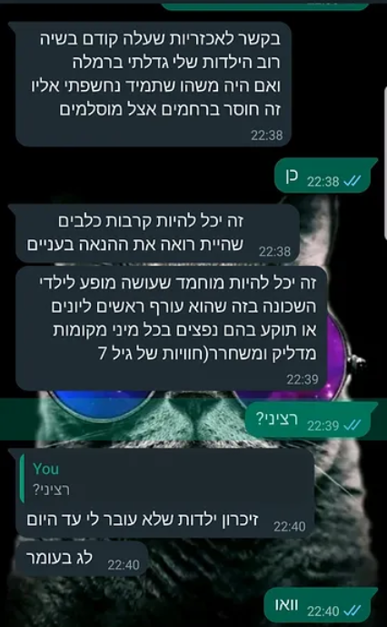
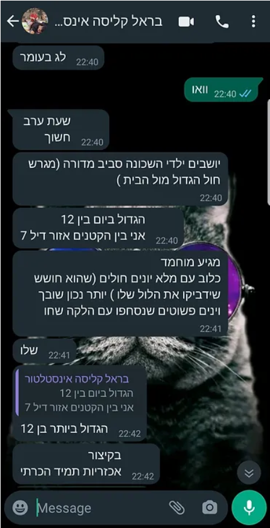

# Eiserne Schwerter, ein Tagebuch von der Heimatfront.

## Der verfluchte Schabbat, Tag 1 des Krieges (7. Oktober 2023):

#### Die große Party beginnt ohne uns.

Sukkot. Wir sind am Ende eines Jeep-Wochenendes in Rumänien. Sie haben die Party angefangen und sich nicht einmal die Mühe gemacht, auf uns zu warten.

Am siebten und letzten Tag der Reise. Raketen, Entführte, Tote und noch mehr Unheil.

Anat wacht morgens auf, in Rumänien, und sieht Warnmeldungen des Heimatfrontkommandos. Und wir sind im Ausland. Surreal!

Ich beschließe, die Flagge von unserem Jeep abzunehmen (in Rumänien). Damit wir im Ausland nicht als Israelis erkannt werden.

Idan ruft an und teilt uns mit, dass wir absolut nicht verstehen, was im Land passiert.

Idan sagt, so etwas hat die Welt noch nicht gesehen.

Idan berichtet, dass die Grenze zu Gaza durchbrochen wurde.

Zu unserem Nachteil. (Jedes Mal, wenn ich diesen Satz lese, den ich selbst geschrieben habe, steigt mir etwas in der Kehle hoch.)

Dass drei IDF-Stützpunkte sich in Luft aufgelöst haben. Dass die Stützpunkte jetzt verbrannt sind und unter Hamas-Kontrolle stehen.

Dass Kibbuzim niedergebrannt und evakuiert wurden. Und die Bewohner bereits nach Gaza verschleppt wurden. (Geiseln.)

Meiner Meinung nach hat sich Idan vertan und die 19. Staffel von Fauda geschaut.

Unser Gefühl: Benommenheit. Wir sind im Ausland. Weit weg. Spüren, dass uns eine Dimension fehlt. Wir sind so weeeiiit weg von allem.

Idan sagt, es sei Jom Kippur all over again.

Und ich bin sicher, dass Idan übertreibt.

Heute ist Schabbat. Idan wurde einberufen. Das ist ungewöhnlich. Er nimmt das Auto und parkt es neben seiner Einheit. Schreibt „IDF" drauf, um keinen Strafzettel zu bekommen. Anat bittet darum, dass wir noch ein paar Tage in Rumänien bleiben.

Aber ich fühle eine zu große Zugehörigkeit zum Land. Jüdisch zu sein bedeutet auch, nicht davonzulaufen, wenn es schwer wird.

Die Fluggesellschaft storniert unseren Flug nach Hause. Und dann stuft sie ihn wieder als regulären Flug ein.

Nach seelischen Strapazen [[aber dazu in einem anderen Beitrag]](https://edenguy.wixsite.com/blog/post/%D7%98%D7%99%D7%A1%D7%94-155) kommen wir im Land an.

Heute hatten wir keine Sirenen.

Anat und die Kinder schlafen im Schutzraum.


## Tag 2 des Krieges (der schwerste Tag)

Ich fühle mich wie dieses Kind in der ersten Klasse, das am ersten Schultag nicht da war, und das ganze Jahr das Gefühl hat, etwas verpasst zu haben, und fragt: „Na, was war am ersten Tag?"

Wir hören, dass Beobachterinnen der Gaza-Division in einem Raum eingesperrt, bei lebendigem Leib verbrannt und dann zur Sicherheit hingerichtet wurden. Von wem sie das wohl gelernt haben.

Sapir, meine Beobachterin, erzählt, dass es einen Cyberangriff auf die Kameras gab.

Die Beobachterinnen hatten keinen Schutz.

Und als die Kameras wieder liefen, sahen die Beobachterinnen Horden von Terroristen, die den Grenzzaun überquerten.

Zur gleichen Zeit gab es auch einen Cyberangriff auf die Kommunikation.

Die Beobachterinnen konnten keine Verstärkung rufen, weil die Kommunikation angegriffen wurde.

Der Rest ist Geschichte.

Sapir hat vor einem halben Jahr den Beobachterinnenkurs abgeschlossen.

Sapir wurde einem Posten zugeteilt. Genauso gut hätte sie in Gaza stationiert sein können.

Die Wahrscheinlichkeit dafür macht mir Angst.

In einem Paralleluniversum habe ich jetzt eine Tochter, die in Gaza als Geisel gehalten wird.

Oder Schlimmeres.

Wir halten bei der Arbeit eine Versammlung des gesamten israelischen Standorts ab.

Menschen lassen ihrem Herzen Luft.

- Ich warte auf den Einberufungsbescheid. Und bekomme Aufgaben von meinen Vorgesetzten. Und was, wenn ich im Kampf falle? Niemand bei der Arbeit wird wissen, dass ich gefallen bin. Die Leute im Büro werden mich ein paar Wochen lang nicht sehen und einfach vergessen, dass ich existiert habe.

- Wird das Unternehmen weiterhin unsere Gehälter zahlen? Auch nach ein oder zwei Monaten Kampf, wenn wir nicht produktiv sind? Wie bezahlen wir den Kindergarten und die Hypothek?

- Ich habe Meetings mit Kunden. Heute bin ich zum Meeting erschienen, aber man sagte mir, das Meeting sei abgesagt, weil mein Kunde in Gaza gefangen gehalten wird.

Kein Auge bleibt bei diesem Gespräch trocken.

Es ist schrecklich und erschütternd.

Noch nie habe ich Emotionen in solcher Intensität erlebt.

Vielleicht am 11. September.

Nach diesem erschütternden Gespräch rufe ich Idan an. Erzähle ihm, was in der Besprechung zur Sprache kam. Kann die Tränen nicht zurückhalten. Weine ihm am Telefon vor.

Das ist der Tag, der mir seelisch am schwersten fällt.

Ein Kind sollte seinen Vater nicht zerbrechen sehen.

Oder vielleicht doch?

In den Nachrichten bitten sie uns, zu Hause zu bleiben, weil Terroristen in Pickup-Trucks auf den Straßen des Landes unterwegs sind.

Einen Pickup mit Terroristen hat man anderthalb Kilometer von unserem Haus entfernt gefunden.

Ich verklebe die Fenster zur Straße hin mit Karton. Damit kein Licht von der Straße zu sehen ist.

Das sind Dinge, die mein Großvater im Unabhängigkeitskrieg gemacht hat. Als sie aus der Luft bombardiert wurden. Verdunkelung.

Das Heimatfrontkommando gibt eine Sondermeldung heraus, die, da bin ich sicher, keinem einzigen Haushalt in Israel ein Gefühl von Sicherheit einflößt.

„Sondermeldung" an die Bürger: Das Heimatfrontkommando ruft heute Abend dazu auf, Trockennahrung, Wasser und weitere Vorräte für 72 Stunden zu bevorraten. Der Aufruf richtet sich an alle Bürger.

Dies sind die Anweisungen:

◾ Wasservorrat von 3 Litern pro Person und Tag, für 72 Stunden

◾ Vorrat an Trocken- und Konservennahrung

◾ Beleuchtungsmittel oder batteriebetriebene Taschenlampe

◾ Mittel zum Empfang von Warnungen und Updates — batteriebetriebenes Radio und Powerbanks für Mobiltelefone

◾ Medikamente

◾ Erste-Hilfe-Set

◾ Persönliche Dokumente, Ausweise und Bargeld

Portugal wird Israelis ermöglichen, ein Flüchtlingsvisum zu beantragen. Ich erwäge eine Bewerbung.

Die Familie ist in Alarmbereitschaft.

Ich bereite 400 Liter Wasser vor.

Fahre los, um den Familientank vollzutanken.

Alarmbereitschaft, kein Scherz.

Lior schreibt einen Brief an die Soldaten.

Ich rufe Sapir an. Sapir berichtet, dass Terroristen in Ortschaften im Nachbarabschnitt eingedrungen sind. Mir wird schwarz vor Augen. Mir ist nicht gut.

Ich bin in Panik. Werden sie den Angriff auf die Beobachterinnen in Gaza wiederholen?

Der Stresspegel steigt und steigt. Brodelt. Droht zu platzen. Die Angst ist kaum auszuhalten.

Ich rufe Idan an. Idan sagt, wenn in den Medien dazu aufgerufen wird, sich mit Batterien und Kerzen einzudecken, bedeutet das, dass die Hisbollah aus dem Norden und auch der Iran zur Party eingeladen sind.

Der Stresspegel erreicht den Siedepunkt.

Ich weiß nicht, was ich mit mir anfangen soll.

Es ist erst der zweite Tag. Und die Zukunft sieht überhaupt nicht rosig aus.

Morgen wird es besser. Ich belüge mich selbst.

Anat und die Kinder schlafen im Schutzraum.

Heute gab es 3 Sirenen.


## Tag 3 des Krieges

Alle paar Stunden mache ich einen Check-in mit Idan. Und mit Sapir.

Sapir erzählt, dass alle Wehrdienstleistenden in den Süden geschickt wurden.

Zwei Reservisten bewachen sie.

Na dann. Jetzt bin ich beruhigt...

Sapir kann keine Verbindung zu ihrer Freundin vom Beobachterinnenkurs herstellen, von der Gaza-Division.

Anat und ich wissen bereits, was mit ihr passiert ist. Aber wir wollen es nicht erzählen.

Sapir gibt uns einen Namen und fleht uns an herauszufinden, was mit ihr geschehen ist.

Sapir weiß absolut nichts über das Schicksal der Beobachterinnen.

Es bricht uns das Herz. Und wir erzählen ihr nicht, dass ihre Freundin von der Hamas entführt wurde.

Endlose Schlangen von Menschen, die Blut spenden wollen. Herzerwärmend. Auch Eden steht in der Schlange zum Spenden.

Fahre zur Tankstelle, um mich mit noch mehr Wasser einzudecken. Und mehr Trockennahrung.

Bereite einen Holzbalken für den Schutzraum vor, damit man die Tür nicht von außen öffnen kann.

Die Kinder verstehen nicht, wozu das gut ist.

Ich möchte lieber, dass sie es weiterhin nicht verstehen.

Aber ich bin nicht zufrieden mit diesem Balken. Er ist nicht zuverlässig.

Heute hat mich die Sirene mitten im Training erwischt. Hat mein Workout unterbrochen. Das geht jetzt wirklich zu weit.

Meine Cousine Stacey aus Philadelphia meldet sich und fordert Updates. Was passiert in Israel? Wie weit sind wir von Ground Zero entfernt?

Ich eröffne eine WhatsApp-Familiengruppe mit ihr und poste Updates.

Sie ist einfach fassungslos. Lädt uns alle zu sich ein. Es ist Platz.

Anat und die Kinder schlafen im Schutzraum.

Heute gab es zwei Sirenen.


Tag 4 des Krieges

Idan kam heute nach Hause, um das Auto zurückzubringen, wechselte die Unterwäsche und rannte zurück zur Einheit. Er verbrachte zehn Minuten zu Hause.

Er sagt, er versteht nicht, wie wir einfach zu Hause sitzen und darauf warten, dass es vorbeigeht. Wie wir nicht mitmachen. Zur Kriegsanstrengung beitragen, etwas tun, kämpfen.

Einfach zu Hause sitzen und auf bessere Zeiten warten. Er sitzt 19 Stunden am Tag vor der Tastatur. Vielleicht 20. Seit einer Woche. Kämpft. Er ist rund um die Uhr von Menschen umgeben, die handeln.

Plötzlich kommt er nach Hause und sieht Leute, die Löcher in die Luft starren.

Das heißt, er versteht schon, dass wir Zivilisten sind und das nicht von uns erwartet wird, aber er läuft seit einer Woche auf 180% CPU, und plötzlich sieht er seine beiden hirntoten Eltern zu Hause, und das ist verstörend. Der Kontrast.

Ich erzähle Idan, dass ich 100 warme Mahlzeiten kochen und Sapir in ihre Einheit bringen wollte. Aber sie sagte, es gäbe genug Essen in der Kantine.

Ich dachte über das nach, was Idan gesagt hat, und beschließe, mich freiwillig zu melden, um Landwirten zu helfen, die ihren Einberufungsbescheid bekommen haben.

Es fehlen Arbeitskräfte in der Landwirtschaft. Ware wird nicht vom Feld eingeholt. Herzzerreißend. Das ist gutes Essen. Das weggeworfen wird.

Ich würde gerne dort helfen, wo es wirklich nötig ist. In den Gemeinden am Gaza-Grenzgebiet. Aber Anat legt ein Veto ein.

Ich kontaktiere Leket Israel. Und mache mit ihnen einen Termin für morgen aus.

Sapir bekommt ein Foto ihrer Freundin in Fesseln in Hamas-Gefangenschaft. Es bricht uns das Herz, dass sie es auf diese Weise über ihre Freundin erfährt.

Galit, eine Freundin aus der Grundschule, ruft heute an und erzählt, dass Assaf, ein Klassenkamerad, die Nachricht erhalten hat, dass seine Tochter, eine Soldatin, im Schlaf bei der Gaza-Division erschossen wurde.

Assaf Groman ist völlig am Boden zerstört.


Noa Marciano, Sapirs entführte Freundin, wird in den Hamas-Tunneln festgehalten.


Galit versteckt sich hinter dem Grenzzaun an der Straße während einer Sirene.


Tag 5 des Krieges

Gehe früh morgens einkaufen.

Die Regale im Supermarkt sind ziemlich leer.

Keine Lieferungen, keine Mitarbeiter im Supermarkt, keine Ware, nur Kassiererinnen.

Die Regale sind leer. Wie in Osteuropa zu Zeiten des Kommunismus.

Am Nachmittag ging eine Beschwerde bei der Polizei ein von einem Bewohner unserer Nachbarschaft über eine verdächtige Person, die außerhalb der Siedlung in den Sanddünen mit einem großen Rucksack unterwegs war.

Als ich zum Rucking-Training losging (großer Rucksack mit 30 Kilo Gewicht, Wandern in den Sandhügeln neben dem Haus), hielt mich ein Polizeiwagen an und bat um meine Personalien. Sie ließen mich natürlich sofort gehen. Aber man kann daraus auf die Nervosität und Angst der Bewohner schließen.

Als ich Sapir von dem Vorfall erzähle, rollt sie sich vor Lachen.

Schön, dass es mir gelungen ist, sie zum Lachen zu bringen.

Anat druckt Mandalas aus und malt mit den Kindern.

Ich teile meinem Chef meine Schwierigkeiten mit, sage ihm, dass ich bei der Arbeit nicht mehr so produktiv bin wie früher. Er nimmt es mit vollem Verständnis auf.

Sapir erzählt uns, dass die Mädchen in der Kommandozentrale beschlossen haben, den Schabbat zu halten — zum Gedenken an die Beobachterinnen, die ermordet oder entführt wurden.

Dass wir nicht versuchen sollen, sie am Schabbat zu erreichen, weil ihr Telefon nicht verfügbar sein wird. Sie halten den Schabbat.

Das hat mir noch gefehlt. Dass Sapir anfängt, religiös zu werden.

Ich stelle mir vor, wie ich zu „Osher Ad" gehe, um Einweggeschirr zu kaufen, weil Sapir sich sonst weigert, mit uns am Schabbattisch zu sitzen.

Das hat mir wirklich noch gefehlt!!!

Sapir beruhigt mich und sagt, es sei einmalig.

Ich bin nicht beruhigt. Jeder Baal Teschuwa fängt mit einem einzigen Mal an.

Ich hatte eine Idee für eine App.

```
Statt alle zu fragen, ob alles in Ordnung ist, nach einem Raketenalarm.
Ich registriere mich,
markiere, von wem ich wissen will, dass er in Ordnung ist.
Nach einer Sirene markiere ich, dass ich in Ordnung bin.
Und dann kann ich sehen, wer von Freunden/Familie in Ordnung ist und wer nicht geantwortet hat.
Es wird eine schöne Matrix sein, die sich langsam asynchron grün füllt.
Und nach 5 Minuten bekommen wir eine Benachrichtigung, wer nicht geantwortet hat.
Einfachstes Pub-Sub.
(Die App zeigt auch an, wer einen niedrigen Akkustand hat oder außerhalb der Reichweite ist und deshalb nicht geantwortet hat. Und jeder Nutzer muss seine Follower genehmigen. Privatsphäre.)
Hatte die Idee schon vor 15 Jahren, während der Anschläge.
Aber jetzt ist sie relevanter.
Ein Tag Arbeit, um das aufzusetzen.
Wird ein Hit.
React, AWS.
```

Die Freunde sind begeistert von der Idee. Anat weniger.

Heute gab es zwei Sirenen.

Anat und die Kinder schlafen im Schutzraum.


Tag 6 des Krieges

Wache um 3 Uhr morgens auf. Kann nicht einschlafen. Der Schlaf flieht.

Schreibe mit meinem Freund Barel.

Er fragt, ob ich die Gespräche mit ihm in mein Kriegstagebuch aufnehme.

Also bitte. Ich nehme sie auf.

Barel patrouilliert in seiner Siedlung mit einer Waffe. Deshalb ist er um 3 Uhr morgens verfügbar.

Ich frage ihn, wie die Mizrachim so warm, liebevoll und herzlich sein können, aber die Araber so bösartig und grausam.

Es dauert lange, bis er antwortet, und ich befürchte, er könnte beleidigt sein, dass ich Mizrachim mit Arabern vergleiche.

Aber ich meinte es eigentlich als Kompliment.

Barel erzählt von einer Lag-BaOmer-Aufführung, die sich ihm aus der Kindheit eingeprägt hat, bei der ein arabischer Junge Tauben quälte, sie anzündete, ihnen Böller hineinsteckte.

Grausam sind sie, die Araber.

Barel schickt ein aktuelles Foto von sich. Von seiner nächtlichen Patrouille.

Und ich empfehle ihm, sich dringend zu rasieren, damit ihn nicht eine Grenzpolizei-Patrouille anhält.

Ich trete dem Forum „Brüder für die Landwirtschaft" bei. Suche Möglichkeiten für landwirtschaftliche Freiwilligenarbeit. Man fragt mich, ob ich beim Melken helfen kann.








Trete dem Forum „Brüder für die Landwirtschaft" bei.


Tag 7

07:00 Uhr, Adi (meine Schwester) ruft an.

Anhand der Uhrzeit verstehe ich, dass etwas passiert.

Adi erzählt mit zitternder Stimme, dass ihre Tochter Mai, die seit anderthalb Jahren in Australien lebt, beschlossen hat, nach Israel zurückzukehren, um zu kämpfen. Ihr Zuhause während zweieinhalb Jahren Wehrdienst wurde zerstört. (Gaza-Brigade.) Und sie kann nicht untätig danebenstehen und passiv bleiben.

Adi ist voller Angst. Versucht sie zu überreden, nicht zu kommen.

Aber Mai hat sich entschieden.

Papa ruft an. Wir reden.

Papa — „Wie haben wir nichts aus dem Jom-Kippur-Krieg gelernt?"

Ich — Ich kann dir versprechen, dass der Jom-Kippur-Krieg auch ein drittes Mal passieren wird, auch den Enkeln, in 50 Jahren. Es ist unmöglich, eine Grenzlinie 200 Jahre lang hermetisch zu sichern. Dinge passieren. Und werden passieren.

Papa — Ich muss den Bildungsminister austauschen. Israels Kinder kennen keine Geschichte. Wie kommt es, dass meine Enkel keine Geschichte kennen? Und warum wissen meine Kinder nichts, was vor dem Jahr 2000 passiert ist?

Ich — Werde genervt, habe keine Lust, mir Vorwürfe anzuhören von jemandem, der vorhat, den Bildungsminister zu ersetzen, und lege auf.

Man sagt, Hunde haben eine Konditionierung auf die Sirene entwickelt und laufen als Erste in den Schutzraum, wenn die Sirene ertönt.

Nur Shuki, unser Hund, ist halb taub und eilt bei keiner Sirene in irgendeinen Schutzraum.

Heute gab es zwei Sirenen.

Anat und Lior schlafen im Schutzraum.


Tag 9 des Krieges

OK, heute regnet es richtig. Rufe bei Leket Israel an und mache einen Termin für morgen. Morgen ganz sicher.

Ich kaufe einen Riegel für die Schutzraumtür. Montiere den Riegel. Anstelle des umstrittenen Holzbalkens. Zeige Lior, wie man Nieten drückt. Erkläre ihm den Unterschied zwischen einem Mauerbohrer und einem Metallbohrer.

Die Kinder lernen heute von zu Hause. Per Zoom.

Anat spielt jeden Tag jede Menge Brett- und Kartenspiele mit den Kindern.

Sie genießt es auch sehr. Entschädigung für all die Jahre, in denen sie sich geweigert hat, Spiele zu spielen.

Die Kinder werden süchtig nach Spielen mit Anat.

Mai hat sich einberufen lassen.

Heute zwei Sirenen.

Anat schläft mit Lior im Schutzraum.


Tag 10 des Krieges

Heute ist der Tag, an dem ich für einen Tag Bauer bin.

Ich gehe in der Landwirtschaft helfen.

Ein riesiges Feld in Rischon LeZion. Wir ernten Kohlrabi.

Es gibt unglaublich viele Freiwillige. Aus dem ganzen Land. Jeden Alters. Es wärmt einem das Herz, diesen Freiwilligengeist im Volk zu sehen.

Wir werden gebeten, den Kohlrabi zu pflücken, die Wurzeln und Blätter zu entfernen, einen Eimer zu füllen, und wenn der Eimer voll ist, den großen Container zu befüllen.

Nach drei Stunden sind alle müde. Aber zufrieden.

Ich komme nach Hause und versuche, Lior abzulenken. Wir füllen eine große Schüssel mit Wasser und jeder Menge Eis.

Wir tauchen den Kopf in die Schüssel. Das hat viele positive Wirkungen. Aktiviert das parasympathische Nervensystem, setzt Endorphine frei, stärkt das Immunsystem.

Es stellt sich heraus, dass an den Seiten des Kopfes Kälterezeptoren sitzen. Deshalb ist das Eintauchen des Kopfes in Eiswasser fast wie ein Eisbad für den ganzen Körper.

Wir bekommen beide einen Brain Freeze.

Wir machen auch die Dead-Hang-Challenge an der Stange. 100 Sekunden hängen.

Ich schaffe 100 Sekunden. Gerade so. Lior schafft eine Minute. Was ziemlich beeindruckend ist.

Anat bereitet mit den Kindern Burekas mit Käse und Kartoffeln zu.

Ich möchte mit Lior Schokoladenkugeln machen, aber wir haben keine Petit-Beurre-Kekse.

Noch eine herzzerreißende Nachricht von Sapir.


Tag 11 des Krieges

Lior schickt mich zu seiner Schule, um Bücher und Hefte zu holen, die er dort vor dem Krieg gelassen hat.

Die Schule ist verlassen und leer. Wie in den Corona-Tagen.

Ich kaufe Petit-Beurre. Heute machen wir zusammen Schokoladenkugeln.

Mein Freund Guri findet heraus, dass die Terroristen, die vor 11 Tagen nach Israel eingedrungen sind, unter Drogen standen.


Tag 12 des Krieges

Die Terrororganisation Hamas gab heute bekannt, dass ein hochrangiger Kommandeur des militärischen Flügels, Ayman Nofal, von der IDF im Zentrum des Gazastreifens getötet wurde — die bisher bedeutendste gezielte Tötung. Er war verantwortlich für die Koordination zwischen den verschiedenen Bataillonen der Terrororganisationen im Streifen.

Heute hatten wir 7 Sirenen. Die Tötung von Ayman erklärt das.

Nachts bekommt Lior eine Panikattacke. Zittern, flache Atmung.

Anat macht mit ihm Atemübungen.


Ich stoße auf ein Überwachungskamera-Video vom Kibbuz Be'eri. Man sieht, wie Scharen dort eindrangen.

Es sah aus wie ein Platz in Gaza. Kämpfer, Kinder, Alte und Behinderte, Jugendliche. Alles Mögliche.

Es war wie ein Schulausflug. Jeder marschierte hinein und überquerte die Grenze nach Israel, nahm sich ein Souvenir mit — einen Juden zum Anbinden im Wohnzimmer — und kehrte nach Gaza zurück, nachdem er die örtlichen Bewohner misshandelt hatte.

Tag 13 des Krieges. Shuki lernt, mit uns in den Schutzraum zu rennen.

Wir sind uns nicht sicher, ob der Auslöser die Sirene ist, oder ob er uns alle panisch zum Schutzraum rennen sieht.

Wir beschließen, es zu testen.

Wir zählen rückwärts: 3...2...1... und rennen zusammen zum Schutzraum.

Shuki rast mit uns.

Das war's. Der Hund ist taub.

... Es stellt sich heraus, dass einige Dutzend Hamas-Terroristen sich in Israel aufhalten.

Israelische Araber geben ihnen Essen. Und Unterschlupf.

Wenn es etwas gibt, das einem Angst macht... dann das.


[Das ist der Stoff, aus dem meine Albträume sind](https://edenguy.wixsite.com/blog/post/%D7%A7%D7%9C%D7%90%D7%A5-%D7%91%D7%9E%D7%98%D7%A2-%D7%94%D7%90%D7%A0%D7%95%D7%A0%D7%95%D7%AA). Dutzende Terroristen bewegen sich frei in Israel.

Alle paar Monate verfolgt mich diese Szene im Traum. Irgendwie finde ich mich am Ende des Traums auf der Flucht vor bewaffneten Terroristen wieder.

Aber jetzt ist es real.

Und es gibt Zeugenberichte von Menschen, die stundenlang um die Klinke des Schutzraums gegen entschlossene Terroristen auf der anderen Seite der Tür gekämpft haben.

Und angesichts all dessen, und des Stresses, der sich bei mir nach einer ruhigeren letzten Woche wieder aufbaut, beschließe ich, die Riegel am Schutzraum zu verbessern.

Ich habe einen Riegel, und möchte drei weitere installieren.

Das wird mir etwas Seelenruhe verschaffen.

Ich gehe zum Baumarkt in der Nachbarschaft, aber alle Riegel sind ausverkauft. Gehe zu Ace — die Riegel sind nicht massiv genug.

Home Depot... auch nicht.

Am Ende berate ich mich mit Bar-El, dem Freund Barel, der mir solide Riegel bringt, und zusammen installieren wir die Riegel.


Tag 14 des Krieges

Ich erwäge, einen Waffenschein zu beantragen.

Das sind verrückte Zeiten. Nie im Leben hätte ich daran gedacht, eine Waffengenehmigung zu beantragen.

Leider erfülle ich die Bedingungen nicht. Ich bin Schütze 02. Das Kriterium ist 03. Oder Wohnort in einer Frontlinie-Gemeinde.

Ich tröste mich damit, dass Rischon LeZion in anderthalb Wochen eine Frontlinie-Gemeinde sein wird. Und dann werde ich losrennen, um einen Waffenschein zu beantragen.

Sapir hat eine Ukulele. Sie hebt die Moral der Kämpfer in ihrer Einheit mit ihrer Ukulele.


Sapir erzählt, dass man ihnen gesagt hat, sie sollen sich mental auf 60 Tage auf dem Stützpunkt vorbereiten.

Mir ist nicht ganz klar, wie man sich mental auf so etwas vorbereiten kann.

Es wird darüber geredet, dass israelische Araber in Städten umhergehen, auch in Tel Aviv, und Häuser fotografieren.

Dutzende Posts darüber auf Facebook.


Der Schekel verliert an Wert.

Tag 15 des Krieges

Heute ist ein Festtag zu Hause.

Idan kommt für 24 Stunden Erholung.

Ich hole ihn am Bahnhof ab.

Große Freude. Endlich kehrt der verlorene Sohn nach Hause zurück.


Idan erzählt von seinen Erlebnissen in der Einheit.

Erfahrungen, die er, davon bin ich überzeugt, nirgendwo sonst machen wird. Zu keiner anderen Zeit.

Wir veranstalten ein Freitagabendessen zu Ehren von Idan.

Sapir fehlt uns.

Heute wurden 3 Raketen aus dem Jemen auf Israel abgefeuert. Die Front wird zweifellos heißer.

Der Abschuss von drei Raketen und 15 Drohnen durch die Huthi auf Israel und deren Abfang durch das amerikanische Kriegsschiff sind die Verwirklichung der Drohungen und Versprechen der letzten Woche. Der Beschuss erhöht jedoch die Wahrscheinlichkeit, dass auch die Hisbollah in den Krieg eintritt | Analyse

Am Tag 13 des Krieges traten Iran und die USA in den Krieg ein. In Teheran setzte man die Drohungen fast wörtlich um, den Krieg auf weitere Schauplätze auszuweiten, und die Amerikaner erfüllten ihr Versprechen, Israel auch operativ zu unterstützen, wenn nötig — nicht mit Bodentruppen, sondern durch das Abfangen von Raketen und Drohnen, die von iranischen Stellvertretern aus Gebieten abgeschossen werden, die nicht in der Nähe der israelischen Grenze liegen.

Amerikanische Soldaten werden nicht am Boden in Israel und für Israel kämpfen, aber die USA werden bei der Abwehr von Raketensalven aus den entfernten Flanken der radikalen schiitischen Achse helfen.

Tag 16 des Krieges

Heute Morgen hatten wir um 09:00 Uhr eine Sirene. Das ist ungewöhnlich.

Es scheint, als hätte die IDF den nördlichen Teil des Streifens unter Kontrolle, und sie können nur noch aus dem Süden des Streifens schießen.

Wir sind das neue Tel Aviv. Es scheint, als könne man Tel Aviv nicht mehr erreichen. Wir sind das nördlichste Ziel.

Unsere Haushaltshilfe sagt, wir seien zu gestresst, denn es gebe reichlich Zeit, um in den Schutzraum zu gelangen.

Lior bittet darum, bei meiner Trainingsroutine im Garten mitzumachen.

Wir legen seine Lieblings-Playlist auf und trainieren zusammen. Heute Arm-Training.


Steak und Lobster. Auf dem Deck des Flugzeugträgers Gerald Ford im Mittelmeer wurden gestern Abend Steak und Lobster serviert. Die Seeleute wissen, dass so ein Gericht an Feiertagen serviert wird — oder um die Moral vor einem Einsatz zu heben.


Lior wachte heute Nacht aus einem Albtraum auf.

In seinem Traum isst er einen Keks. Einen Granola-Keks, den er mit Mama und Itai gebacken hat. Im Traum ertönt eine Sirene. Und es ist eine besondere Sirene, die nur eine halbe Minute Zeit bis zum Schutzraum gibt statt anderthalb Minuten. Lior rast zum Schutzraum, den Keks im Mund. Vor lauter Stress verschluckt sich Lior an dem trockenen Keks. Papa (ich) macht den Heimlich-Griff, rettet ihn, und der Keks fliegt ihm aus dem Hals. Mama sieht den Keks unversehrt aus Liors Hals fliegen und fällt in Ohnmacht. Und dann bin ich aufgewacht.

Tag 17 des Krieges

Wache um 02:00 Uhr auf und kann nicht wieder einschlafen.

Alle meine roten Linien sind überschritten.

Ich will hier nicht mehr leben.

Wir haben es versucht. Wirklich versucht.


Mache für Sapir einen Termin zur Erneuerung ihres amerikanischen Passes im US-Konsulat in der Hayarkon-Straße.


Heute ist ein glücklicher Tag.

Sapirchen kommt nach Hause zur Erholung.

Die kleinen Freuden des Lebens.

Sapir kommt um 14:00 Uhr. Und muss morgen schon vor 07:00 Uhr zurück zum Stützpunkt.

Ich nehme sie zum Einkaufen mit. Ausrüstung ergänzen. Thermounterwäsche, Jacke, Socken. Ricochet gibt uns einen Gutschein.

Einen fetten Gutschein.

Sapir erzählt Anekdoten.

Es scheint nicht, als hätte sie sich verändert.

Ziemlich normales Verhalten.

Keine posttraumatische Belastungsstörung.

Obwohl sie von der Kompaniechefin aus der Grundausbildung erzählt, die ermordet wurde, und von Beobachterinnen-Kameradinnen, die ermordet oder entführt wurden.

Aber es scheint an ihr abzuprallen, ohne Spuren zu hinterlassen.

Ich glaube, dass Dinge in einigen Jahren auftauchen werden.


Tag — ich höre auf zu zählen...

Der Durchschnitts-IQ in der Bevölkerung liegt bei 100 mit einer Standardabweichung von 15.

In Gaza liegt der Durchschnitt bei 85, mit der gleichen Standardabweichung.

Das bedeutet, unter 2 Millionen Gazanern gibt es 120 Leute mit einem IQ von 145, die als Genies gelten.

Ich habe große Bedenken wegen einer Bodenoffensive. Ich bin sicher, dass dort Überraschungen auf uns warten, die unser desolater Geheimdienst nicht vorhersehen kann.

Die 120 Genies aus Gaza haben uns sicher Fallen gestellt.

Tag folgt auf Tag.

Die Verzweiflung wächst von Tag zu Tag.

Und ich habe keine Lust mehr, das Tagebuch zu aktualisieren.

Anat und Lior schlafen immer noch im Schutzraum.

31. Oktober, Tag 20 des Krieges

Wache am Morgen des 31. Oktober auf. Reibe mir die Augen und gehe hinunter ins Wohnzimmer.

Sehe eine Girlande aus Luftballons im Wohnzimmer hängen.

Und verstehe nicht ganz, was das soll.

Ach, Mensch. Heute ist mein Geburtstag.

Vergessen.

Überrascht.

Es ist schön, Aufmerksamkeit zu bekommen.


Zu Ehren meines Geburtstags beschließe ich, einen Geländelauf im offenen Feld zu machen.

Anat warnt, dass im offenen Feld keine Raketen abgefangen werden.

Ich ignoriere das.

Meine geistige Gesundheit ist mir wichtiger.


Mittags, nach einem Arbeitsmeeting, ruft Lior mich in die Küche. Ich komme, und sie singen mir „Happy Birthday"; es gibt auch eine Torte.

Da nur ich seit einem Monat einkaufen gehe, ohne zu wissen, wofür, kaufte ich, was auf der Einkaufsliste stand: Kekse und Käse für einen Käsekuchen.

Sie haben mich reingelegt.

Am Nachmittag fahre ich zu Decathlon, kaufe einen roten Boxsack, hänge ihn im Garten auf und schreibe „Hamas" mit schwarzem Filzstift drauf.

Jetzt lassen die Kinder jede Menge Aggressionen an Hamas aus. Die Emotionen des letzten Monats, all die Sirenen, die Frustration. Alles kommt in entfesselten Fäusten raus.

Das ist eine tolle Sache. Große Befriedigung, Hamas zu treten. Therapeutisch.


Tag 30 des Krieges

Sapir kommt für anderthalb Tage nach Hause. Zum ersten Mal verlässt sie die Kommandozentrale für so lange Zeit.

Wir fühlen uns wieder vollständig.

Sapir sieht gut aus. Wirkt richtig stark. Die unerträglichen Ereignisse haben sie kaum beeinflusst.

Ich bin zufrieden.

Sehr.


Ich nehme sie und die Jüngeren zum Eisessen. Bei „Andiamo".


Anat liebt dieses Foto. Patriotisch. Uniform und Flagge.


Idan schickt mir eine Nachricht auf WhatsApp.

Was hat das auf einmal damit zu tun?

Wieso wieder ein Rückfall in Tag zwei des Krieges?

Ich gehe wieder in volle Alarmbereitschaft, wechsle das Wasser im Schutzraum aus. Fülle Vorräte auf.


Ich drehe wieder am Rad. Schlafe nachts nicht gut.

Woher kam Idan plötzlich mit diesem Mist?

Versuche, ein paar mehr Details zu entlocken. Aber Idan ist im Bunker.

Kein Wort.

Und da ist eine weitere Nachricht, die mich an den Jom-Kippur-Krieg erinnert:

Vor dem Hintergrund des Krieges gegen Hamas hat Jordanien angekündigt, seinen Botschafter in Israel zu Konsultationen zurückzurufen.

Der Anführer der Huthi droht Israel. Abdul-Malik al-Huthi, Anführer der vom Iran unterstützten Rebellen im Jemen, sagte: „Das jemenitische Volk wird nicht zögern, den Dschihad gegen Israel auszurufen."

Heute wurden Raketen von den Huthi-Rebellen aus dem Jemen in Richtung Rotes Meer abgefeuert.

Das im Jemen entzündete Streichholz könnte Saudi-Arabien und die USA zwingen, Farbe zu bekennen.

Zweifellos wird die Front heißer.

Wer hatte je von diesen Huthi gehört, bis heute? Woher kam das? Jemen? Ist das überhaupt ein echtes Land?

Zum ersten Mal überhaupt in der Nähe des Nahen Ostens: das größte und teuerste Kriegsschiff der Welt. 90 Flugzeuge, 4.300 Besatzungsmitglieder und bewaffnete U-Boote: Die USA bringen Flugzeugträger vor Israels Küste in einer Demonstration der Unterstützung im Krieg gegen Hamas. Der Flugzeugträger „Ford", das größte und teuerste Kriegsschiff der Welt, wurde bereits im Mittelmeer stationiert, und nächste Woche soll auch die „Eisenhower" ankern.


Salesforce, das amerikanische Unternehmen, gewährt seinen israelischen Mitarbeitern einen Kriegsbonus. Die Mitarbeiter des Unternehmens erhalten eine einmalige Prämie von 10.000 Schekel zum November-Gehalt.

Schön zu wissen, dass man uns sieht. Dass man an uns denkt.


Anat erreicht das Fenster des Schutzraums nicht, um es zu schließen. Deshalb installiere ich eine Wäscheleine mit Umlenkrolle, die das Schließen des Schutzraumfensters erleichtert.

Anat ist nicht sonderlich beeindruckt.

Lior sagt, er möchte bei meiner Trainingsroutine mitmachen.

Eine gute Sache, die aus diesem verfluchten Krieg hervorgeht.

Lior schließt sich mir an, und wir trainieren zusammen.

Lior hat einen guten Körper. Kräftig. Wenn er ein bisschen in sich investiert und trainiert, wird er zum Monster.


Diese Woche fahre ich endlich ins Büro nach Tel Aviv.

Ein bisschen Normalität.

Ein bisschen Fitnessstudio mit Menschen mit Puls.


Es ist sehr schön, Menschen zu treffen.

Flurgespräche.

Ich vermisse das sehr.

Auf dem Rückweg sehe ich zum ersten Mal Plakatwände mit Fotos der Entführten.

Aufwühlend.


Der Arbeitgeber ermöglicht es uns, mit einem Fachmann über die Schwierigkeiten, Krisen und Ängste zu sprechen.

Anat und ich verbinden uns per Zoom mit Kami, der Therapeutin.

Sie ist wirklich kompetent. Im Gespräch beschließen wir schrittweise, den Schutzraum zu verlassen, das Haus zu verlassen; vielleicht gehen die Kinder zu den Pfadfindern. Zu Freunden, zur Schule. Kami hat uns wirklich geholfen.

Ich hätte nicht gedacht, dass ein einziges Zoom-Gespräch so effektiv sein kann.

Anats Mutter kommt zu einem kurzen Besuch und probiert unseren Schutzraum aus.


Anat erklärt, dass sie heute Nacht im Schlafzimmer schlafen wird und Lior in seinem Zimmer.

Aufregung. Nach 30 Tagen Schlafen im Schutzraum.

Zu Ehren des Anlasses bekamen wir zwei nächtliche Sirenen. Eine um 21:00 Uhr. Und eine um 22:00 Uhr.

Lior erklärt, er habe hervorragend geschlafen.

Er ließ Anat schwören, dass sie ihn als Allererstes weckt, wenn es eine Sirene gibt, und ihn nicht vergisst.


Wir belegen Platz 3. Nach Sderot.

Respektabel.

Der tapfere Oded kommt ins raketengebeutelte Rischon LeZion, um mich zu besuchen.

Wir bereiten Leckereien auf dem Grill zu und diskutieren über Kriegsangelegenheiten.


7. November. Ein Monat Krieg.

Lior zieht zum ersten Mal seit zwei Monaten sein Schulhemd an.


Schule.

Die Heimatfront beginnt, zur Normalität zurückzukehren.


Ich fahre ins Büro nach Tel Aviv.

Arbeitsroutine.

Plötzlich wird über Lautsprecher eine Schweigeminute um 11:00 Uhr zum Gedenken an die Opfer angekündigt.

Wir stehen eine Schweigeminute lang still.

Was, erst ein Monat ist vergangen? Ich schwöre, es fühlt sich an wie ein halbes Jahr.

Man verteilt Anstecker zum Gedenken an die Gefangenen und Gefallenen.


Alle in Solidarität.


Die fünfte Kriegswoche — die Noa-Woche

#### Mittwoch, 14. November. Anats Geburtstag.

Der schreckliche Tag, den wir gefürchtet hatten, ist gekommen.


Am Morgen schickt Sapir mir ein Snuff-Video, das die Hamas veröffentlicht hat und das zeigt, dass Noa Marciano durch IDF-Bombardierung getötet wurde.

Sapir hat Angst, sich das Video anzusehen, und bittet mich zu schauen und ihr zu erzählen, was darin gezeigt wird.

Nach dem Ansehen teile ich Sapir mit, dass ich glaube, das Ganze sei eine zynische Fälschung der Hamas. Offensichtlich unglaubwürdig.

Etwa zwei Stunden später kommt Anat weinend zu mir gerannt. Sie hat erfahren, dass Noa Marciano in Hamas-Gefangenschaft ermordet wurde.

Das Schlimmste ist eingetreten.

Was für einen schönen Geburtstag wir Anat beschert haben.

Wir rufen mit Angst und Zittern Sapir an. Überbringen ihr die schreckliche Nachricht.

Sapir erzählt uns, dass Noa ihr in der Grundausbildung einen Brief geschrieben hat und sie gebeten hat, ihn erst nach der Grundausbildung zu lesen.

Sapir hatte das bis heute vergessen.

Die ganze Familie sucht jetzt nach dem kleinen schwarzen Notizbuch, in dem Noa Marciano einen wichtigen Brief an Sapir geschrieben hat.

Wir finden es nicht :(

Anat und ich laufen den ganzen Tag wie Zombies herum.

Ohne Lust auf irgendetwas.

Ich kann mir nur vorstellen, was unsere Sapirchen durchmacht.

Das ist ein sehr schwerer Tag für mich. Für uns. Einer der schwersten.


Da es keine Leiche gibt, sitzt die Familie Schiwa, ohne Beerdigung.

Wir verabreden uns, am Donnerstag mit Sapir zur Trauerbekundung nach Modiin zu fahren.

Vermutlich wird der Marsch der Geiselfamilien, der auf dem Weg nach Jerusalem ist, genau am Donnerstagmittag bei ihnen vorbeikommen.


Hamas, eine Terrororganisation, hat der israelischen Supermacht den schwersten militärischen Schlag ihrer Geschichte versetzt. Die Täuschung war perfekt. Das Versagen des Geheimdienstes war absolut. Die Folgen waren katastrophal, und nur das Ausmaß der Demütigung übertraf das Versagen. Israel stand kurz vor einem historischen Friedensabkommen mit Saudi-Arabien, das den Friedenskreis mit der sunnitischen Achse geschlossen, die Palästinenser in eine schwarze Kiste eingeschlossen und ins Meer geworfen hätte. Stattdessen haben sie fast uns ins Meer geworfen. Der Übergang, den wir an jenem Schabbat, dem 7. Oktober, durchlebten, ist einer der schärfsten in der Geschichte. Mit einem Schlag verwandelte sich das israelische Imperium von einer selbstzufriedenen, arroganten und selbstsicheren Supermacht, die im Iran, in Syrien und überall dazwischen zuschlug, die ihre Geheimdiensterkenntnisse an alle Verehrer verteilte, die den Takt im gesamten Nahen Osten vorgab und weltweit ein Leuchtturm der Technologie, Stärke und Nachrichtendienste war — zu einem schiffbrüchigen Boot in den Wellen, einer Nation in existenzieller Panik, Bürgern, die versuchen, sich eine Pistole oder ein Messer zusammenzukratzen, um damit unter dem Kopfkissen zu schlafen, selbst wenn sie mitten in Tel Aviv wohnen.

Die Zeit friert ein. Jeder Tag fühlt sich an wie der 7. Oktober.


#### Donnerstag

Heute sind wir mit Sapir nach Modiin gefahren. Zum Haus der Familie von Noa Marciano. Zur Trauerbekundung.

Ihre Mutter macht den Eindruck einer sehr beeindruckenden Frau.

Sehr.

Wir treffen dort eine Frau, die zum Kondolieren gekommen ist. Sie erzählt, dass sie zwei Töchter hat. Eine Beobachterin, in Gaza entführt. Und die andere nimmt am Marsch der Entführten teil.

Anat umarmt sie unter Tränen.

Es gibt nicht viel zu sagen.

Ein Trauerzelt wurde aufgestellt, in dem sich Dutzende von Männern mit Kippot und Rabbiner versammeln, Kaddisch sprechen und die Wochenlesung besprechen.

Es ärgert mich, diese ganze Sache. Die „Stärkung im Glauben" in Zeiten der Krise.

Wir gehen hoch in Noas Kinderzimmer. Sapir geht ihre Sachen durch, fotografiert die Korrespondenz zwischen Noa und ihrer Kommandantin.

Die Situation ist für niemanden leicht.

An der Seite stehen zwei große blaue Kisten, geschmückt mit der israelischen Flagge — Noas persönliche Gegenstände, die die IDF ihren Eltern geschickt hat.

Herzzerreißend.


#### Freitag

Wir wachen am Freitagmorgen auf, und da kommt die Nachricht:

Tag 42 der Kämpfe | Die IDF hat den Leichnam der Soldatin Noa Marciano nach Israel überführt, die in Hamas-Gefangenschaft getötet wurde.

Also gibt es doch eine Beerdigung.

Der Leichnam wurde gestern in der Nähe des Shifa-Krankenhauses gefunden, einen Tag nach der Bergung des Leichnams von Yehudit Weiss aus dem Kibbuz Be'eri. Drei Palästinenser wurden bei einem IDF-Angriff in Dschenin getötet, die Truppe umstellte das Krankenhaus der Stadt. Blinken sprach mit Gantz und den Außenministern Ägyptens und Jordaniens und sagte, die USA würden sich gegen eine erzwungene Umsiedlung von Palästinensern aus Gaza aussprechen.


Sapir ist auf dem Weg von ihrer Einheit, um an der Beerdigung teilzunehmen.


Sapir fährt nach Modiin, um an der Beerdigung teilzunehmen und letzte Ehre zu erweisen.

Die Klasse von Lior hat Grüße an die Soldaten geschickt. Herzerwärmend. Die Soldaten freuen sich.


#### Der 3. Kriegsmonat

Tag 78 des Krieges.

Heute wurde der Noa-Marciano-Weg eingeweiht. Sapir ist nach Modiin gefahren, zur Einweihungszeremonie.

In der Stadt Modiin gibt es eine Tradition, nach der jeder gefallene Soldat, der aus der Stadt stammt, eine Straße nach seinem Namen bekommt.


Ein Freund von mir wird diese Woche im Ichilov-Krankenhaus für eine Notoperation eingeliefert.

Er erzählt, dass alle anderthalb Stunden Hubschrauber vom Süden auf dem Landeplatz des Krankenhauses landen, mit Schwerverletzten.

Dutzende oder mehr Verwundete kommen pro Tag an. Das Krankenhaus ist überflutet. Schließt die Notaufnahme. Etwas äußerst Seltenes.

Das Mindeste, was ich tun kann, ist eine Blutspende.


Freiwilligentag, Kaki-Ernte


