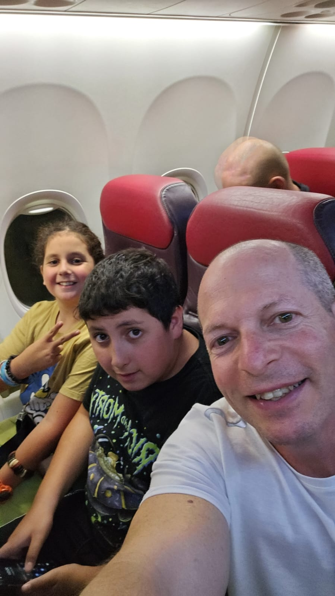

הדיילת מדגימה איך משתמשים בהתקן הציפה שתחת למושב, ואיך מתפעלים את ערכת החמצן שמעל לראש, מבטיחה שהערכה תיפתח במקרה התרסקות. מצביעה על מושבי המעבר המהווים מסדרון מילוט בחירום.

אני רומז לענת לשים לב טוב. כי הפעם הזו היא הפעם היחידה שההסבר הזה רלוונטי באמת. רלוונטי מתמיד. ללא ציניות.

מתעוררים הבוקר ליום קריר ברומניה. היום האחרון מתוך שבוע של טיול ג'יפים בטרנסילבניה. ענת אומרת לי "בלאגן בארץ"

אני מגיב בביטול שזו סתם עוד אפיזודה שלבטח תחלוף במהרה.

במשך השעות מתגלה גודל הזוועה. חטופים. בסיסים שנמחקו. עידן מעדכן שגבול עזה התעדכן.

התעדכן לרעתנו.

עידן אומר לי שאני לא מבין מה באמת קורה. עידן מספר לי שקרו דברים שהעולם עוד לא ראה.

ואני באמת לא קולט.

... לטילים לעבר גוש דן אף אחד כבר לא מתייחס.

ואני רוצה למסך מהילדים הקטנים. לגונן. להסתיר.

כשאני נכנס לחדר שלהם במלון, איתי כבר מעודכן, קרא בפורומים בווטסאפ. אולי אף יותר מעודכן ממני. לך תדע. אני לא חופר.

הילדים מעדכנים אחד את השני במהירות לא הגיונית.

כל פעם שיש אזעקה בארץ, הם מעדכנים מי בממד, ומי שמע נפילה. כיתה ה', ואלה העדכונים שלהם.

רומניה. יוצאים מסיביו.

סיביו (Sibiu) היא עיירה בדרום טרנסילבניה שברומניה. מקיפים את אגם בלה הקסום בטיול רגלי, ותוך כדי כך ליאור מקריא לנו עשרות הודעות שקיבל מחברים לכיתה, איך כל אחד רץ לממד. חוויות סוביקטיביות מהאזעקה.

בארוחת הצהריים מחלקים לנו פיצות. הביאו במיוחד בשבילי פיצה עם מיני בשרים. אבל אני לא בקטע של פיצה.

יוצאים מהמסעדה לנסיעה דרך מעבר טראנספאגרשן קורטה דה ארגש. לדברי המדריך, הקטע הכי יפה ברומניה.

אלדד, המדריך, גם מבטיח לראות דובים בצידי הדרכים.

אבל למי יש ראש לראות דוב ...

אלדד מנסה להסיט את תשומת ליבנו מהחדשות בארץ, ולתבלן את הדרך בסיפורים מהווי המקום. הוא גם קצת מצליח ואנחנו מדי פעם שוכחים מהמצב החרבנה בארץ לכמה שניות.

זה היום האחרון לטיול. הלילה טסים ארצה.

כל כמה דק מרפרש את האפליקציה, לראות אם הטיסה יוצאת. כי רוב הטיסות בטלות ומבוטלות היום. במיוחד בחברות הטיסה הזרות.

ענת מציעה שאולי נשאר ברומניה עוד מס ימים, עד יעבור זעם. למה לסכן את הילדים?

המשפט הזה מכניס אותי לסחרחרה.

במשך כמה שעות אני בקונפליקט גדול.

מסתגר בפינה שלי. שוקל בעד ונגד.

אני מתייעץ עם חברים, שואל לדעתם.

עוברות עליי שעות לא פשוטות, בין הדובים והשועלים של אלדד, הטבע השופע ירק, לבין הקונפליקט... להישאר עם שני הילדים הצעירים שלי, ולהפקיר את שני החיילים שלי לבד בארץ? להשאר? לחזור? לברוח? להשאר? לחזור?

ומה בעצם אני משדר לילדים הצעירים? בריחה? מה אני משדר לילדים שלי שמגינים על המולדת ביחידה שלהם? נטישה? דיסוננס קוגניטיבי הכי חריף.

מחוזק מהחברים, אני מחליט שמקומנו בארץ. לא לשוטט ברחובות בוקרשט. לא אמתין שיהיה נעים ונוח לחזור, וגם אז... לך תדע מתי תהיה טיסה חזרה. לארבעתנו.

אנחנו מצטיידים במזון יבש, לכל מקרה שלא יהיה. אנחנו בכוננות ספיגה. המון סימני שאלה.

המון תרחישים מקבילים רצים בראש.

בדלפק הצ'קאין בשדה התעופה, הדיילת יודעת לספר שטיסה 155 בוטלה לפני שעתיים. והוחזרה לטיסה סדירה לפני שעה.

אנחנו מוסרים את המזוודות שלנו, בתקווה שנשוב לראותן בבן גוריון.

אנחנו מתקדמים אל עבר השער שלנו, רואים שרוב הטיסות לארץ בזו אחר זו מתבטלות להן, חברות הביטוח לא מסכימות לבטח את חברות התעופה שמטיסות מטוס לאזור לחימה. וחלקן של הטיסות אף מופנות בחזרה לנמל המוצא שלהן. לא מאפשרים נחיתות בישראל.

שעת הבורדינג, העלייה למטוס כבר הגיעה לפני חצי שעה. אבל לא נותנים לאנשים לעלות למטוס.

ספקולציות.

הבוס שלי, יונתן, מתקשר לענת, להתעדכן לגבי המצב.

אחרי עוד חצי שעה, מדפיסים מניפסט נוסעים מלא. (זה תמיד הפרוטוקול? למה להדפיס?) וסוף סוף מעלים אותנו למטוס.

אנחנו יושבים במטוס זמן שנדמה כנצח.

ענת מראה לי פוסט שמדבר על אלפי טילים בשעתיים האחרונות אל עבר גוש דן. ולראשלצ.

לשם אנו מועדים.

אני עוד לא בטוח שהמטוס ימריא.

הילדים מאד לחוצים. ליאור לא רוצה לחזור לארץ מוכת טילים.

הוא מאד חושש. אני די משותק מפחד. מה אני עושה לילדים שלי? וענת, שהעדיפה להשאר עוד כמה ימים בבוקרשט, אולי זה היה הדבר השפויי? אבל הבת שלי בבסיס, והבן שלי בבסיס, מה לגביהם?

אני מספר לליאור שהארץ שלנו היא שלנו. שזה מה שיש לנו. כן, אזעקה וטיל פעם בשנה, שנתיים, אבל רוב הזמן טוב. ואי אפשר לברוח מהבית. מספר לו שיש ילדים בעוטף שזו השגרה בעבורם.

ואני חושב לעצמי, מה אתה עושה? מביא את הילדים לאזור לחימה... אזעקות. איך נחזור מהשדה הביתה בכלל? ומה אם תהיה אזעקה בדרך? ובכלל, אין מוניות... איך נגיע? ברגל? המטוס עתיד לנחות ב 3 לפנות בוקר. חוסר וודאות. איזה איש שפויי מביא שני ילדים לאזור לחימה?

ליאור תולה בי מבט מתחנן, ושואל אם משהו רע עלול לקרות לעידן או לספיר.

נשבר הלב.

כולם מלבדי נרדמים.

זו הקללה הקבועה שלי, לא יכול להרדם בטיסות. במיוחד לא בטיסה זו. מסתכל בקנאה בכל הנרדמים סביבי. שמצליחים להמלט מהמחשבות הטורדניות לשעה קלה.

ליאור רואה שאני בסטרס, והוא מנחם אותי. מלטף אותי. אני מנסה להיות מנחם, ויוצא מנוחם.

ואז ליאור מעלה משאלה: "שהערבים יחליטו שלא שווה להם הלחימה הזו, ופשוט יתחרטו, ויחזרו לנשים שלהם, לבתים שלהם, לישון."

אנחנו מחייכים, ומצטרפים לתפילה הדמומה של ליאור.

אנחנו כבר מעל ישראל.

הפעם המטוס לא עובר במסלול הרגיל. לא נכנס ממערב. אלא נכנס לישראל מצפון, ועובר את כל שמי הארץ בדרכו ללוד.

זה מלול שלאורכו יש מיגון של כיפת ברזל.

מסלול ששמור לעיתות חירום בלבד.

מסלול חגיגי.

אני מתאמץ להציץ דרך החלון ולראות שיגורים. ויירוטים.

מחפש מופע זיקוקים של יום העצמאות.

חושש ממחבל אקראי שישגר טיל כתף לעבר המטוס שלנו.

למה לא, זה אחלה רייטינג לאינסטוש שלו. המחבל שהפיל מטוס נוסעים מעל תל אביב.

הנחמה היחידה שלי היא שליאור ואיתי לא יידעו מה פגע בהם. הם יתאיידו תוך 700 מילישניות. ללא כאבים.

חשוב לשמור על אופטימיות. לראות את הצד החיובי בכל סיטואציה.

המטוס בקושי מאט לקראת הנחיתה. הנחיתה ממש קשה. כנראה תקנה לשעת חירום. לא להאט לקראת הנחיתה. שיהיה יותר קשה לפגוע בנו.

אחרי שהגלגלים פוגעים בקרקע, כולם מוחאים כפיים, צועקים מילות הודייה ודירבון לטייס. זה מרגש אותי. בדרך כלל אני לא אוהב את מחיאות הכפיים של הישראלים בנחיתה. מחיאות הכפיים האלה שמורות לישראלים. וזה תמיד מבדר אותי.

אבל הפעם יש לזה משמעות מיוחדת.

וזה מרגש.

אנחנו יורדים מהמטוס בחוסר סבלנות. אני מורה לילדים לאן רצים, לפי השילוט, למרחבים המוגנים, במקרה אזעקה.

אני עדיין לא יודע אם נצליח למצא מונית. המונית שהזמנו לא מגיעה. אין נהג אמיץ מספיק כדי לעשות נסיעה לראשון לציון.

מסתכלים על אולם היוצאים בקומה מתחתנו. הכל נטוש לגמרי.

אחרי שיוצאים מביקורת המכס אנחנו רואים מאות אנשים יושבים ושוכבים בלובי. מחכים לטיסה יוצאת. חלקם תיירים שבורחים מאזור העימות. אי אפשר להשיג טיסות יוצאות.

מחוץ לטרמינל עוד מאות רבות של אנשים. זה מזכיר לי מחנה פליטים. אנשים ישנים ברחוב ועל הספסל עם מזרן מאולתר. כואב הלב.

אני מזמין נסיעה ב Gett.

תוך עשר דק מגיע נהג חביב. תמהוני, אך שירותי וחביב.

הצלחנו להגיע הביתה בלי אזעקות בדרך.

גם כן הישג.

ועכשיו יתחילו הימים המורכבים באמת.
